# Understanding Reactivity Patterns: A Deep Dive into Four Approaches

*Published on December 2024*

Reactivity is a fundamental programming paradigm where systems automatically respond to data changes by updating dependent computations, UI elements, or triggering side effects. Instead of manually managing when to update things, the system tracks dependencies and propagates changes automatically.

In this comprehensive guide, we'll explore four distinct approaches to reactivity, each optimized for different use cases and architectural patterns. We'll examine their implementations, performance characteristics, and when to choose each one.

## Table of Contents

1. [The Four Reactivity Patterns](#the-four-reactivity-patterns)
2. [Signals: Fine-Grained Reactivity](#signals-fine-grained-reactivity)
3. [Proxy State: Transparent Object Reactivity](#proxy-state-transparent-object-reactivity)
4. [Pub-Sub: Event-Driven Communication](#pub-sub-event-driven-communication)
5. [RxJS-style: Functional Reactive Programming](#rxjs-style-functional-reactive-programming)
6. [Performance Comparison](#performance-comparison)
7. [Choosing the Right Pattern](#choosing-the-right-pattern)
8. [Conclusion](#conclusion)

## The Four Reactivity Patterns

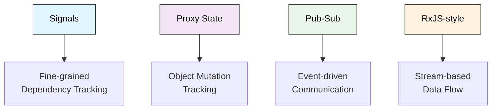

Each pattern solves reactivity differently, optimized for different use cases:

- **Signals**: Perfect for UI frameworks and real-time dashboards
- **Proxy State**: Ideal for complex forms and state trees
- **Pub-Sub**: Great for event-driven architectures and cross-component communication
- **RxJS-style**: Excellent for complex async flows and data transformation pipelines

## Signals: Fine-Grained Reactivity

Signals represent a **fine-grained reactive paradigm** inspired by SolidJS, where reactivity is achieved through automatic dependency tracking rather than virtual DOM diffing or manual dependency declaration.

### How Signals Work

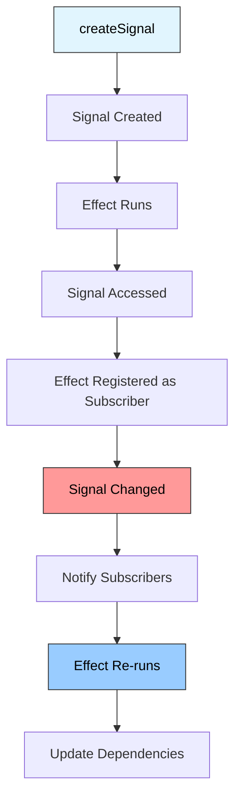

### Dependency Tracking System

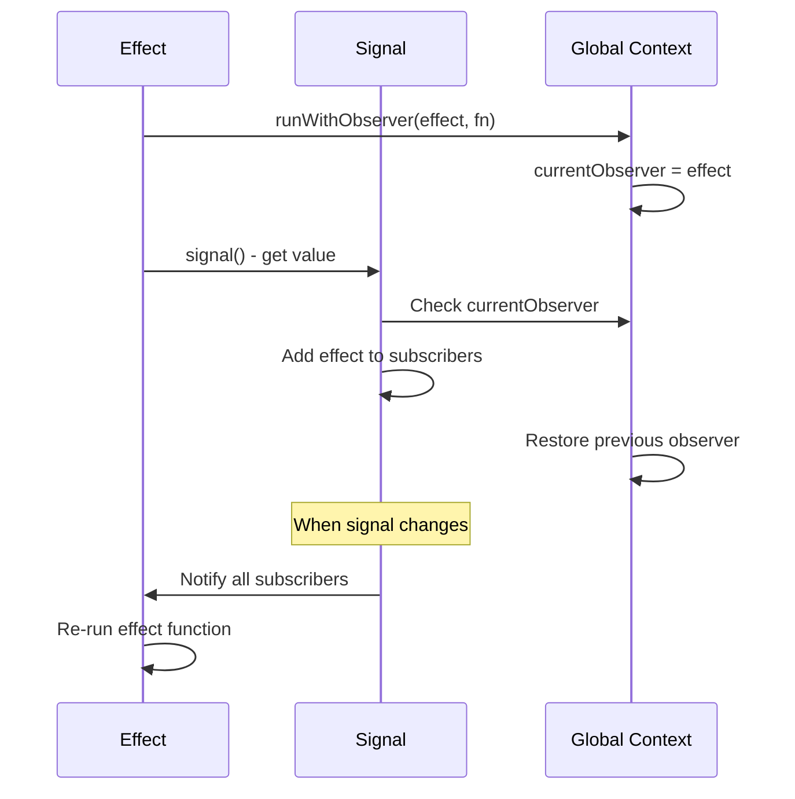

### Core Implementation

The signals implementation provides four main primitives:

- **`createSignal`**: Creates reactive state with getter/setter functions
- **`createEffect`**: Creates side effects that automatically re-run when dependencies change
- **`createMemo`**: Creates derived state that caches computed values
- **`createResource`**: Handles async operations with loading/error states

**🔗 [View Signals Implementation](https://github.com/sujeet-pro/reactivity/blob/main/library/signals/signal.ts)**

### When to Use Signals

**✅ Perfect for:**
- **UI Frameworks**: Building reactive user interfaces with minimal overhead
- **Real-time Dashboards**: Where data updates frequently and UI must stay in sync
- **Game Development**: Fast-paced environments requiring immediate state updates
- **Data Processing Pipelines**: Where computations have clear dependencies
- **Form State Management**: Complex forms with interdependent fields

**❌ Consider alternatives for:**
- **Large Object Mutations**: Signals work best with primitive values
- **Event-driven Architecture**: Pub-sub patterns might be more appropriate
- **Complex Async Flows**: RxJS-style observables handle async better
- **Deep Object Tracking**: Proxy-based solutions are more natural

### Example Usage

```typescript
import { createSignal, createEffect, createMemo, createResource } from '@sujeet-pro/reactivity';

// Create reactive state
const [count, setCount] = createSignal(0);

// Create derived state
const doubled = createMemo(() => count() * 2);

// Create side effects
createEffect(() => {
  console.log(`Count: ${count()}, Doubled: ${doubled()}`);
});

// Create async resources
const userResource = createResource(async () => {
  const response = await fetch('/api/user');
  return response.json();
});

// Update state
setCount(5); // Logs: "Count: 5, Doubled: 10"
```

## Proxy State: Transparent Object Reactivity

Proxy State represents a **transparent reactivity paradigm** where objects become reactive through JavaScript Proxies, enabling automatic change detection without requiring special syntax or manual tracking.

### How Proxy State Works

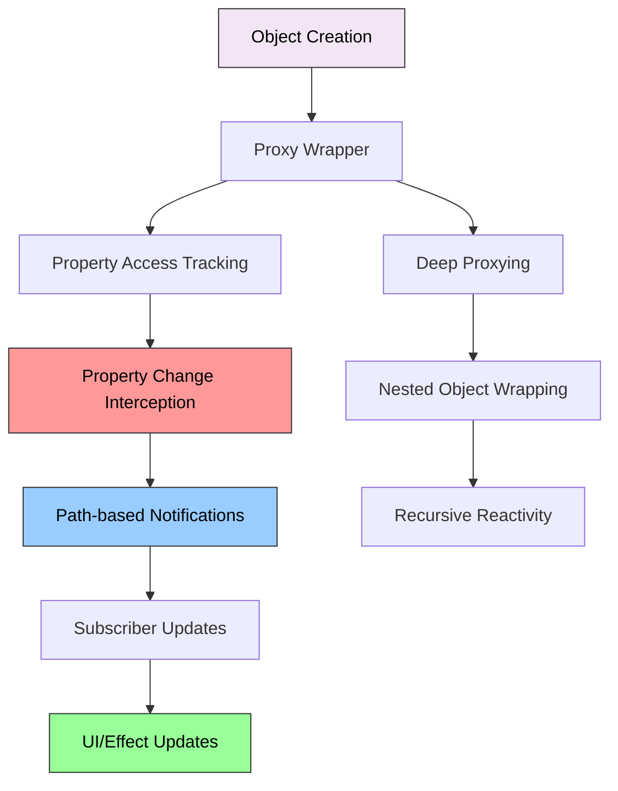

### Proxy Trap Architecture

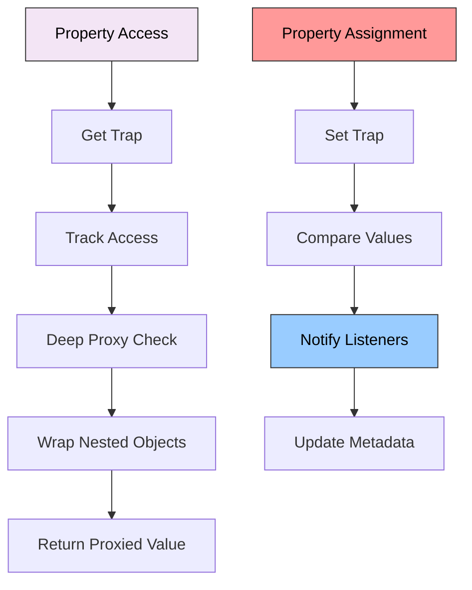

### Core Implementation

The proxy state implementation provides:

- **`createProxyState`**: Creates reactive objects with automatic change tracking
- **`createComputedState`**: Creates derived state that automatically updates
- **`batch`**: Groups multiple changes into a single notification
- **`updateProxyState`**: Provides immutable update patterns

**🔗 [View Proxy State Implementation](https://github.com/sujeet-pro/reactivity/blob/main/library/proxy-state/proxy-state.ts)**

### When to Use Proxy State

**✅ Perfect for:**
- **Form Management**: Complex forms with nested data structures and validation
- **State Trees**: Applications with hierarchical state (file systems, organization charts)
- **Configuration Management**: Settings objects with nested categories and options
- **Data Models**: Working with API responses that have complex nested structures
- **Rapid Prototyping**: When you want reactive behavior without changing existing object code
- **Legacy Integration**: Adding reactivity to existing codebases with minimal refactoring

**❌ Consider alternatives for:**
- **High-Frequency Updates**: Proxy overhead can impact performance in tight loops
- **Primitive Values**: Signals are more efficient for simple values
- **Functional Approaches**: If you prefer immutable update patterns
- **Memory-Constrained Environments**: Proxy metadata adds memory overhead

### Example Usage

```typescript
import { 
  createProxyState, 
  updateProxyState, 
  createComputedState, 
  batch,
  subscribeToStates 
} from '@sujeet-pro/reactivity';

// Create reactive object
const state = createProxyState({ 
  user: { name: 'John', age: 30 },
  settings: { theme: 'dark' }
});

// Subscribe to changes
state.__subscribe((newState, oldState, path) => {
  console.log(`Changed at ${path.join('.')}: `, newState);
});

// Create computed state
const computedState = createComputedState([state], (current) => ({
  displayName: `${current.user.name} (${current.user.age})`
}));

// Batch updates for performance
batch(() => {
  state.user.name = 'Jane';
  state.user.age = 25;
}); // Only triggers one update

// Update state immutably
updateProxyState(state, (draft) => {
  draft.settings.theme = 'light';
});
```

## Pub-Sub: Event-Driven Communication

Pub-Sub provides event-driven communication between decoupled components. It's perfect for cross-component messaging and real-time data synchronization.

### How Pub-Sub Works

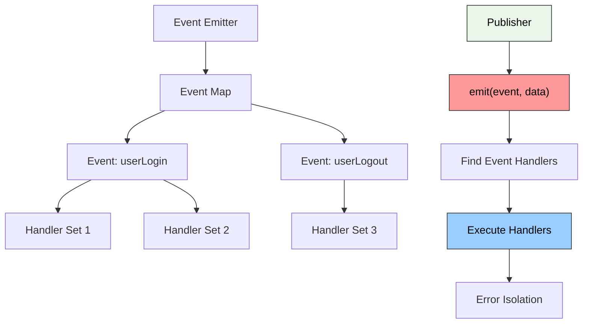

### Event Flow Architecture

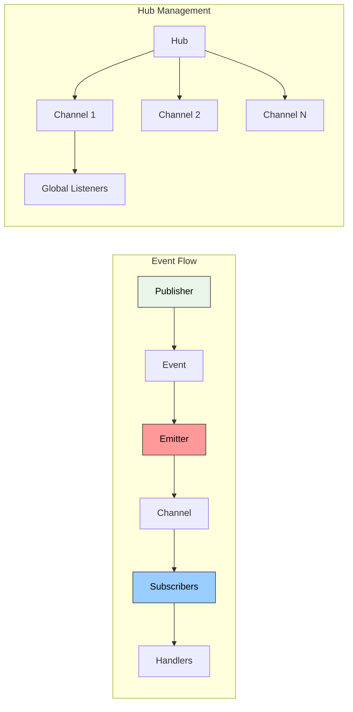

### Core Implementation

The pub-sub implementation provides:

- **`createEventEmitter`**: Creates type-safe event emitters
- **`createReactiveState`**: Creates reactive state with subscription support
- **`createChannel`**: Creates namespaced event channels
- **`createPubSubHub`**: Manages multiple channels with global listeners

**🔗 [View Pub-Sub Implementation](https://github.com/sujeet-pro/reactivity/blob/main/library/pub-sub/pub-sub.ts)**

### When to Use Pub-Sub

**✅ Perfect for:**
- **Event-Driven Architecture**: Microservices, module communication, plugin systems
- **UI Component Communication**: Cross-component messaging without prop drilling
- **Analytics & Logging**: Broadcasting events to multiple tracking systems
- **Notification Systems**: Real-time alerts, toast messages, status updates
- **Workflow Orchestration**: Multi-step processes with conditional branching
- **Integration Layers**: Connecting disparate systems through event interfaces

**❌ Consider alternatives for:**
- **Direct Parent-Child Communication**: Props or direct method calls are simpler
- **Synchronous Operations**: When you need immediate return values
- **Simple State Management**: Signals or proxy state might be more appropriate
- **Performance-Critical Paths**: Direct calls have less overhead

### Example Usage

```typescript
import { 
  createEventEmitter, 
  createReactiveState, 
  createChannel, 
  createPubSubHub,
  combineStates 
} from '@sujeet-pro/reactivity';

// Event emitter
const events = createEventEmitter<{
  userLogin: { userId: string };
  userLogout: void;
}>();

events.on('userLogin', ({ userId }) => {
  console.log(`User ${userId} logged in`);
});

events.emit('userLogin', { userId: '123' });

// Reactive state
const counter = createReactiveState(0);
counter.subscribe(value => console.log(`Counter: ${value}`));
counter.set(prev => prev + 1);

// Channels for namespaced events
const userChannel = createChannel<{ update: any; delete: any }>();
userChannel.publish('update', { id: 1, name: 'Updated' });

// Hub for managing multiple channels
const hub = createPubSubHub();
hub.addChannel('users', userChannel);
hub.getChannel('users')?.subscribe('update', (data) => {
  console.log('User updated:', data);
});

// Combine multiple states
const state1 = createReactiveState(1);
const state2 = createReactiveState(2);
const combined = combineStates({ state1, state2 });
combined.subscribe(({ state1, state2 }) => {
  console.log('Combined:', state1 + state2);
});
```

## RxJS-style: Functional Reactive Programming

RxJS-style provides functional reactive programming with observable streams and operators. It excels at complex async flows and data transformation pipelines.

### How RxJS-style Works

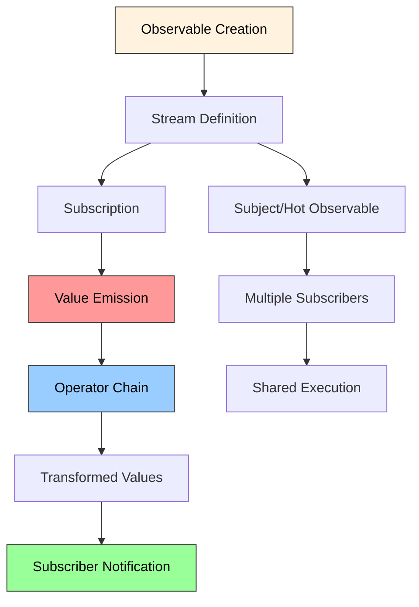

### Observable Stream Flow

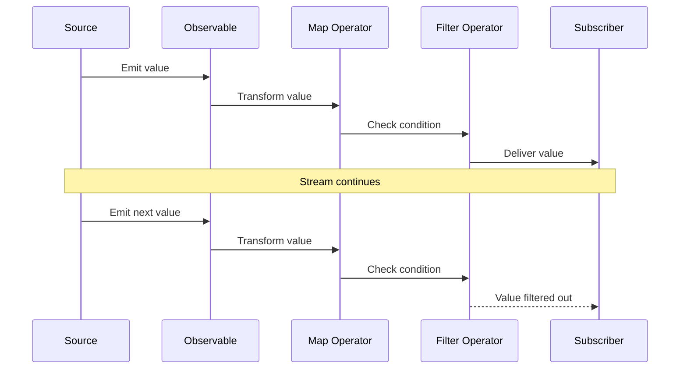

### Core Implementation

The RxJS-style implementation provides:

- **`createObservable`**: Creates observable streams with lazy evaluation
- **`createSubject`**: Creates hot observables for multicasting
- **`createBehaviorSubject`**: Creates stateful observables with current value
- **Operators**: `map`, `filter`, `debounce`, `switchMap`, `combineLatest`, etc.

**🔗 [View RxJS-style Implementation](https://github.com/sujeet-pro/reactivity/blob/main/library/rxjs-reactive/observable.ts)**

### When to Use RxJS-style

**✅ Perfect for:**
- **Complex Async Flows**: API orchestration, retry logic, conditional requests
- **Real-time Data Processing**: WebSocket streams, server-sent events, live updates
- **User Interaction Handling**: Debounced search, drag & drop, complex gesture recognition
- **Animation & Timing**: Smooth animations, scheduled tasks, interval-based operations
- **Error Handling & Recovery**: Sophisticated retry strategies, fallback mechanisms
- **Data Transformation Pipelines**: ETL operations, data aggregation, format conversion

**❌ Consider alternatives for:**
- **Simple State Management**: Signals or proxy state are simpler for basic reactivity
- **Direct Value Storage**: Use signals for simple getter/setter patterns
- **Synchronous Operations**: Direct function calls are more appropriate
- **Memory-Constrained Environments**: Observable chains can have significant overhead

### Example Usage

```typescript
import { 
  createSubject, 
  createBehaviorSubject,
  createObservable,
  fromArray,
  fromPromise,
  interval,
  timer
} from '@sujeet-pro/reactivity';

// Subject
const clicks$ = createSubject<MouseEvent>();

clicks$
  .map(event => ({ x: event.clientX, y: event.clientY }))
  .filter(coords => coords.x > 100)
  .subscribe(coords => console.log('Click:', coords));

// BehaviorSubject (has current value)
const currentUser$ = createBehaviorSubject({ name: 'Anonymous' });
console.log(currentUser$.value); // { name: 'Anonymous' }

// Observable creation utilities
const numbers$ = fromArray([1, 2, 3, 4, 5]);
numbers$
  .map(x => x * 2)
  .filter(x => x > 4)
  .subscribe(x => console.log(x)); // 6, 8, 10

// Timer observables
const timer$ = interval(1000);
timer$
  .take(5)
  .subscribe(count => console.log(`Timer: ${count}`));

// From promises
const data$ = fromPromise(fetch('/api/data'));
data$
  .map(response => response.json())
  .subscribe(data => console.log('Data:', data));

// One-shot timer
const delayed$ = timer(2000);
delayed$.subscribe(() => console.log('Timer fired after 2 seconds'));
```

## Performance Comparison

### Time Complexity Analysis

```mermaid
graph LR
    A[Signals] --> B[Read: O(1)<br/>Write: O(n)]
    C[Proxy State] --> D[Access: O(1)<br/>Change: O(n)]
    E[Pub-Sub] --> F[Emit: O(n)<br/>Subscribe: O(1)]
    G[RxJS-style] --> H[Emit: O(m)<br/>Subscribe: O(1)]
    
    subgraph "Where n = subscribers, m = operators"
        B
        D
        F
        H
    end
    
    style A fill:#e1f5fe,stroke:#333,color:#000
    style C fill:#f3e5f5,stroke:#333,color:#000
    style E fill:#e8f5e8,stroke:#333,color:#000
    style G fill:#fff3e0,stroke:#333,color:#000
```

### Memory Usage Patterns

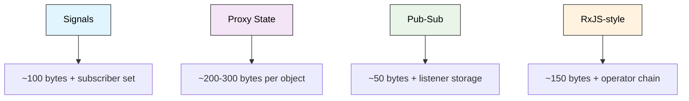

### Performance Characteristics Summary

| Pattern | Read Performance | Write Performance | Memory Overhead | Learning Curve |
|---------|------------------|-------------------|-----------------|----------------|
| **Signals** | Excellent (O(1)) | Good (O(n)) | Low | Medium |
| **Proxy State** | Good (O(1) + proxy) | Good (O(n)) | Medium | Low |
| **Pub-Sub** | N/A | Good (O(n)) | Low | Low |
| **RxJS-style** | Good (O(1)) | Good (O(m)) | Medium | High |

## Choosing the Right Pattern

### Decision Matrix

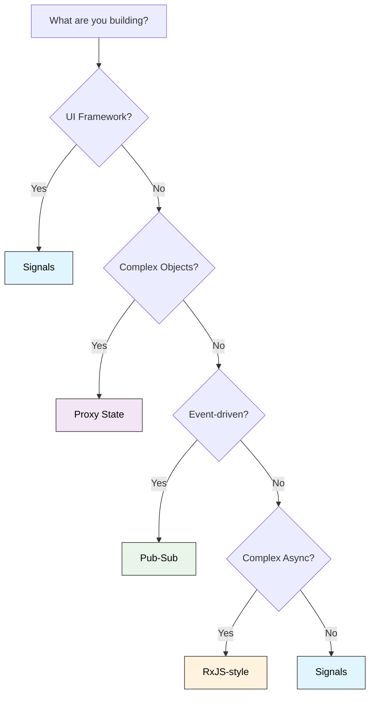

### Use Case Recommendations

#### Choose **Signals** when:
- Building UI frameworks or components
- Need fine-grained reactivity with minimal overhead
- Working with primitive values and simple state
- Want automatic dependency tracking
- Performance is critical

**🔗 [Signals Documentation](https://github.com/sujeet-pro/reactivity/blob/main/library/signals/README.md)**

#### Choose **Proxy State** when:
- Working with complex nested objects
- Need transparent reactivity without API changes
- Building forms with deep validation
- Want path-based change notifications
- Integrating with existing object-oriented code

**🔗 [Proxy State Documentation](https://github.com/sujeet-pro/reactivity/blob/main/library/proxy-state/README.md)**

#### Choose **Pub-Sub** when:
- Building event-driven architectures
- Need cross-component communication
- Working with microservices or plugins
- Want loose coupling between components
- Building notification or logging systems

**🔗 [Pub-Sub Documentation](https://github.com/sujeet-pro/reactivity/blob/main/library/pub-sub/README.md)**

#### Choose **RxJS-style** when:
- Handling complex async flows
- Need sophisticated error handling and retry logic
- Building real-time data processing pipelines
- Want functional composition of operations
- Working with time-based operations

**🔗 [RxJS-style Documentation](https://github.com/sujeet-pro/reactivity/blob/main/library/rxjs-reactive/README.md)**

### Hybrid Approaches

Often, the best solution combines multiple patterns:

```typescript
// Example: UI Framework with multiple patterns
class App {
  // Signals for UI state
  private [count, setCount] = createSignal(0);
  private [user, setUser] = createSignal(null);
  
  // Proxy state for complex form data
  private formState = createProxyState({
    personal: { name: '', email: '' },
    preferences: { theme: 'light' }
  });
  
  // Pub-sub for cross-component events
  private events = createEventEmitter<{
    userLogin: { userId: string };
    themeChange: { theme: string };
  }>();
  
  // RxJS-style for async operations
  private userData$ = fromPromise(fetch('/api/user'))
    .map(response => response.json())
    .retry(3);
  
  constructor() {
    // Combine patterns
    this.events.on('userLogin', ({ userId }) => {
      this.userData$.subscribe(user => setUser(user));
    });
    
    this.formState.__subscribe((newState, oldState, path) => {
      if (path[0] === 'preferences' && path[1] === 'theme') {
        this.events.emit('themeChange', { theme: newState });
      }
    });
  }
}
```

## Conclusion

Each reactivity pattern serves different needs and architectural requirements:

- **Signals** excel at fine-grained UI reactivity with minimal overhead
- **Proxy State** provides transparent object reactivity for complex data structures
- **Pub-Sub** enables loose coupling through event-driven communication
- **RxJS-style** handles complex async flows with functional composition

The key is understanding your specific use case and choosing the pattern that best fits your requirements. Often, combining multiple patterns provides the most flexible and maintainable solution.

### Key Takeaways

1. **Signals** are perfect for UI frameworks and real-time dashboards
2. **Proxy State** is ideal for complex forms and hierarchical state management
3. **Pub-Sub** excels at event-driven architectures and cross-component communication
4. **RxJS-style** handles complex async flows and data transformation pipelines
5. **Performance** varies significantly between patterns - choose based on your specific needs
6. **Hybrid approaches** often provide the best solution for complex applications

### Explore the Implementation

All four patterns are fully implemented and tested in the [reactivity library](https://github.com/sujeet-pro/reactivity). Each implementation includes:

- Complete TypeScript support with full type safety
- Comprehensive test suites with 1000+ tests
- Performance benchmarks and optimization
- Detailed documentation and examples
- Interactive demos showcasing real-world usage

**🔗 [View the complete implementation](https://github.com/sujeet-pro/reactivity)**

Whether you're building a new application or refactoring existing code, understanding these reactivity patterns will help you make informed architectural decisions and build more maintainable, performant applications.

---

*This blog post is based on the comprehensive reactivity library implementation. For more details, examples, and advanced usage patterns, check out the [full documentation](https://github.com/sujeet-pro/reactivity#readme).* 