# Reactivity Library

A comprehensive TypeScript library showcasing different reactive programming patterns and implementations. This library demonstrates four distinct approaches to reactivity: Signals, Proxy-based State, Pub-Sub, and RxJS-style Observables.

## 📚 Navigation

**📖 [Main Documentation](README.md)** (you are here)

**🧠 Individual Pattern Documentation:**
- **[Signals Implementation](library/signals/README.md)** - Fine-grained reactivity with automatic dependency tracking
- **[Proxy State Implementation](library/proxy-state/README.md)** - Object mutation tracking using JavaScript Proxies
- **[Pub-Sub Implementation](library/pub-sub/README.md)** - Event-driven architecture with publishers and subscribers
- **[RxJS-style Implementation](library/rxjs-reactive/README.md)** - Observable streams with functional operators

**🔗 Quick Links:**
- [Examples](examples/) - Interactive examples and demos
- [API Reference](library/) - Complete API documentation
- [Tests](library/*/test.ts) - Test suites for each pattern
- [Performance Benchmarks](library/benchmarks/) - Performance comparisons

---

## 🚀 Features

- **Signals**: Fine-grained reactivity with automatic dependency tracking (SolidJS-style)
- **Proxy State**: Object mutation tracking using JavaScript Proxies with computed states and batching
- **Pub-Sub**: Event-driven architecture with publishers, subscribers, channels, and hubs
- **RxJS-style**: Observable streams with operators, subjects, and behavior subjects for complex data transformations

## 🧠 Core Concepts

### What is Reactivity?

Reactivity is a programming paradigm where the system automatically responds to data changes by updating dependent computations, UI elements, or triggering side effects. Instead of manually managing when to update things, the system tracks dependencies and propagates changes automatically.

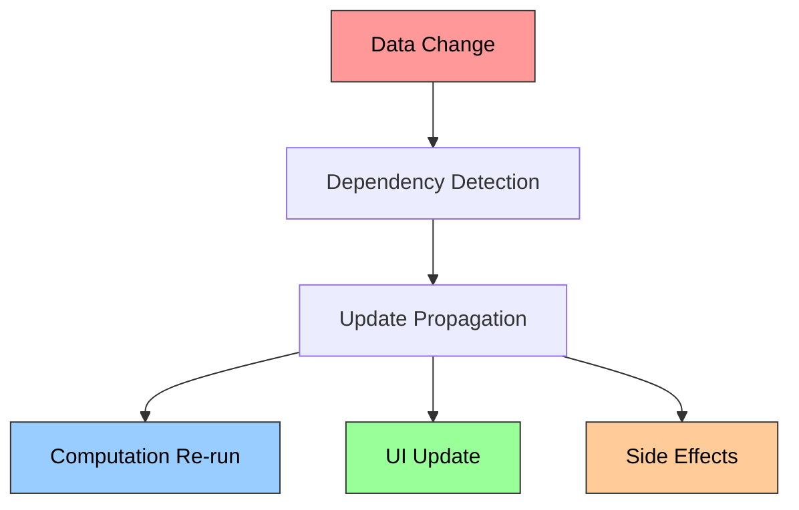
```mermaid
graph TD
    A[Data Change] --> B[Dependency Detection]
    B --> C[Update Propagation]
    C --> D[Computation Re-run]
    C --> E[UI Update]
    C --> F[Side Effects]
    
    style A fill:#ff9999,stroke:#333,color:#000
    style D fill:#99ccff,stroke:#333,color:#000
    style E fill:#99ff99,stroke:#333,color:#000
    style F fill:#ffcc99,stroke:#333,color:#000
```

### The Four Patterns

Each pattern solves reactivity differently, optimized for different use cases:

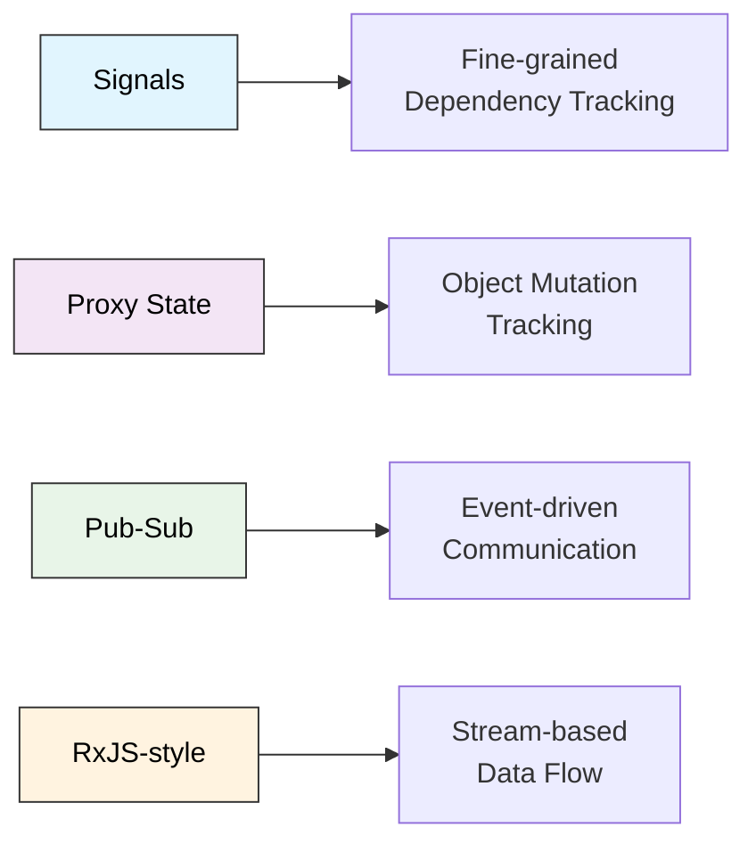
```mermaid
graph LR
    A[Signals] --> B[Fine-grained<br/>Dependency Tracking]
    C[Proxy State] --> D[Object Mutation<br/>Tracking]
    E[Pub-Sub] --> F[Event-driven<br/>Communication]
    G[RxJS-style] --> H[Stream-based<br/>Data Flow]
    
    style A fill:#e1f5fe,stroke:#333,color:#000
    style C fill:#f3e5f5,stroke:#333,color:#000
    style E fill:#e8f5e8,stroke:#333,color:#000
    style G fill:#fff3e0,stroke:#333,color:#000
```

**🔗 Learn more about each pattern:**
- **[Signals](library/signals/README.md)** - Perfect for UI frameworks and real-time dashboards
- **[Proxy State](library/proxy-state/README.md)** - Ideal for complex forms and state trees
- **[Pub-Sub](library/pub-sub/README.md)** - Great for event-driven architectures and cross-component communication
- **[RxJS-style](library/rxjs-reactive/README.md)** - Excellent for complex async flows and data transformation pipelines

## 📁 Project Structure

```
.
├── library/                    # Core reactivity implementations
│   ├── signals/               # Signals implementation
│   │   ├── signal.ts          # Signal primitives (createSignal, createEffect, createMemo, createResource)
│   │   ├── types.ts           # TypeScript definitions
│   │   ├── signal.test.ts     # Test suite
│   │   └── index.ts           # Exports
│   ├── proxy-state/           # Proxy-based state management
│   │   ├── proxy-state.ts     # Proxy state primitives with computed states and batching
│   │   ├── types.ts           # TypeScript definitions
│   │   ├── proxy-state.test.ts # Test suite
│   │   └── index.ts           # Exports
│   ├── pub-sub/               # Publisher-Subscriber pattern
│   │   ├── pub-sub.ts         # Event emitters, channels, hubs, and reactive states
│   │   ├── types.ts           # TypeScript definitions
│   │   ├── pub-sub.test.ts    # Test suite
│   │   └── index.ts           # Exports
│   ├── rxjs-reactive/         # RxJS-style observables
│   │   ├── observable.ts      # Observable creation utilities and operators
│   │   ├── subject.ts         # Subject and BehaviorSubject implementations
│   │   ├── types.ts           # TypeScript definitions
│   │   ├── rxjs-reactive.test.ts # Test suite
│   │   └── index.ts           # Exports
│   └── index.ts               # Main library exports
├── examples/                  # Example applications
│   ├── src/                   # Source code for examples
│   │   └── main.ts            # Interactive examples implementation
│   ├── index.html             # Main example page
│   ├── package.json           # Examples dependencies
│   ├── vite.config.ts         # Vite configuration with single file build
│   └── tsconfig.json          # Examples TypeScript config
├── package.json               # Main package configuration with workspaces
├── tsconfig.json              # TypeScript configuration
├── tsconfig.library.json      # Library-specific TypeScript config
├── vitest.config.ts           # Test configuration
└── README.md                  # This file
```

## 🛠 Installation

### Prerequisites

- Node.js >= 18
- npm or yarn

### Setup

1. **Clone the repository**
   ```bash
   git clone https://github.com/sujeet-pro/reactivity.git
   cd reactivity
   ```

2. **Install dependencies**
   ```bash
   npm install
   ```

3. **Build the library**
   ```bash
   npm run build:library
   ```

4. **Install examples dependencies (automatically handled by workspace)**
   ```bash
   # Dependencies are automatically installed via workspaces
   # But you can install explicitly if needed:
   cd examples
   npm install
   ```

## 🚦 Running Locally

### Development Server

Run the examples with hot reload:

```bash
# From the root directory
npm run dev

# Or from examples directory
cd examples
npm run dev
```

This will start a development server at `http://localhost:5173` with the interactive examples.

### Building for Production

```bash
# Build library only
npm run build:library

# Build examples only
npm run build:examples

# Build both
npm run build
```

### Running Tests

```bash
# Run tests with coverage
npm test

# Run tests with UI
npm run test:ui

# Run library development build in watch mode
npm run dev:library
```

## 📚 Library Usage

### Signals

Signals provide fine-grained reactivity with automatic dependency tracking. They're perfect for UI frameworks and real-time data synchronization.

**🔗 [Detailed Signals Documentation](library/signals/README.md)**

#### How Signals Work

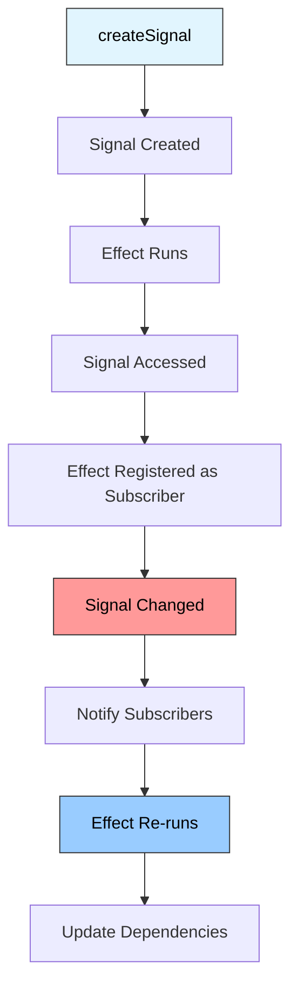
```mermaid
graph TD
    A[createSignal] --> B[Signal Created]
    B --> C[Effect Runs]
    C --> D[Signal Accessed]
    D --> E[Effect Registered as Subscriber]
    E --> F[Signal Changed]
    F --> G[Notify Subscribers]
    G --> H[Effect Re-runs]
    H --> I[Update Dependencies]
    
    style A fill:#e1f5fe,stroke:#333,color:#000
    style F fill:#ff9999,stroke:#333,color:#000
    style H fill:#99ccff,stroke:#333,color:#000
```

#### Core Implementation

```typescript
import { createSignal, createEffect, createMemo, createResource } from '@sujeet-pro/reactivity';

// Create reactive state
const [count, setCount] = createSignal(0);

// Create derived state
const doubled = createMemo(() => count() * 2);

// Create side effects
createEffect(() => {
  console.log(`Count: ${count()}, Doubled: ${doubled()}`);
});

// Create async resources
const userResource = createResource(async () => {
  const response = await fetch('/api/user');
  return response.json();
});

const userData = userResource();
console.log(userData.loading, userData.data, userData.error);

// Update state
setCount(5); // Logs: "Count: 5, Doubled: 10"
```

#### Dependency Tracking Flow

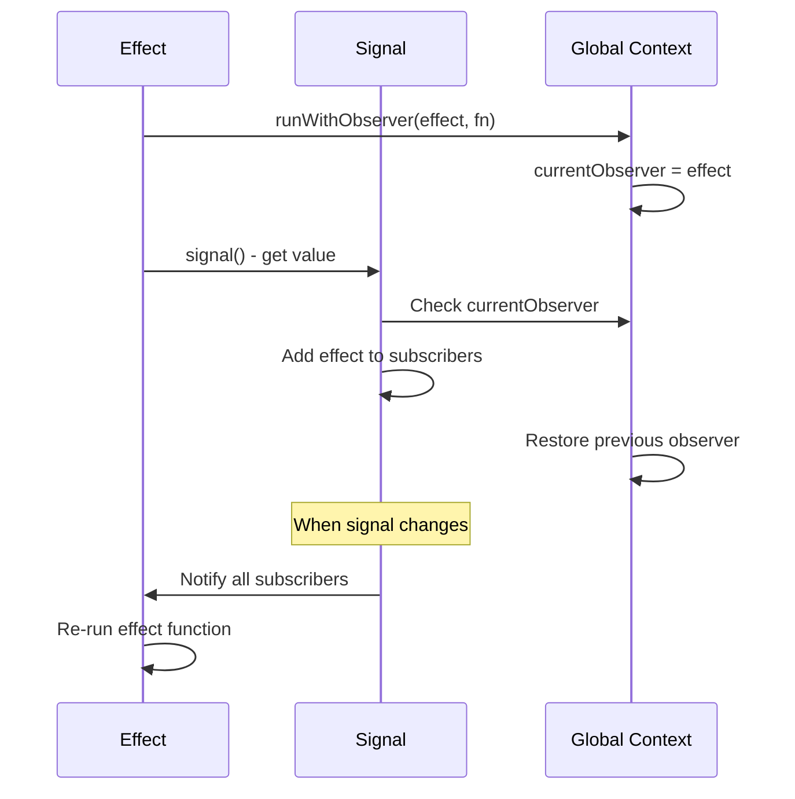
```mermaid
sequenceDiagram
    participant E as Effect
    participant S as Signal
    participant G as Global Context
    
    E->>G: runWithObserver(effect, fn)
    G->>G: currentObserver = effect
    E->>S: signal() - get value
    S->>G: Check currentObserver
    S->>S: Add effect to subscribers
    G->>G: Restore previous observer
    Note over S: When signal changes
    S->>E: Notify all subscribers
    E->>E: Re-run effect function
```

### Proxy State

Proxy State provides transparent reactivity for objects using JavaScript Proxies. It's ideal for complex form management and hierarchical state trees.

**🔗 [Detailed Proxy State Documentation](library/proxy-state/README.md)**

#### How Proxy State Works

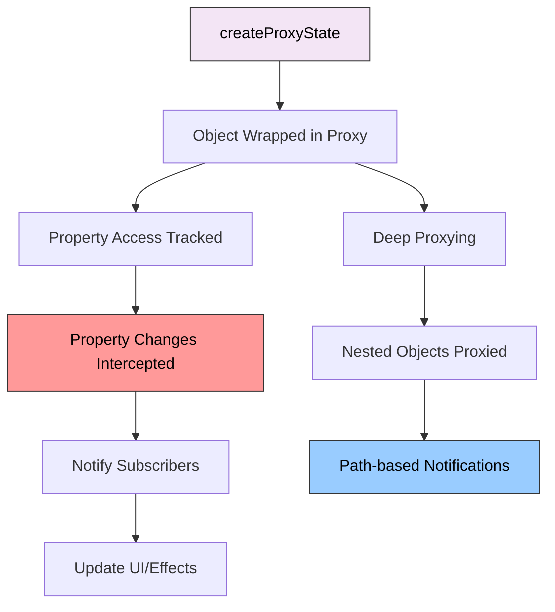
```mermaid
graph TD
    A[createProxyState] --> B[Object Wrapped in Proxy]
    B --> C[Property Access Tracked]
    C --> D[Property Changes Intercepted]
    D --> E[Notify Subscribers]
    E --> F[Update UI/Effects]
    
    B --> G[Deep Proxying]
    G --> H[Nested Objects Proxied]
    H --> I[Path-based Notifications]
    
    style A fill:#f3e5f5,stroke:#333,color:#000
    style D fill:#ff9999,stroke:#333,color:#000
    style I fill:#99ccff,stroke:#333,color:#000
```

#### Core Implementation

```typescript
import { 
  createProxyState, 
  updateProxyState, 
  createComputedState, 
  batch,
  subscribeToStates 
} from '@sujeet-pro/reactivity';

// Create reactive object
const state = createProxyState({ 
  user: { name: 'John', age: 30 },
  settings: { theme: 'dark' }
});

// Subscribe to changes
state.__subscribe((newState, oldState, path) => {
  console.log(`Changed at ${path.join('.')}: `, newState);
});

// Create computed state
const computedState = createComputedState([state], (current) => ({
  displayName: `${current.user.name} (${current.user.age})`
}));

// Batch updates for performance
batch(() => {
  state.user.name = 'Jane';
  state.user.age = 25;
}); // Only triggers one update

// Update state immutably
updateProxyState(state, (draft) => {
  draft.settings.theme = 'light';
});

// Subscribe to multiple states
subscribeToStates([state, computedState], (states) => {
  console.log('Any state changed:', states);
});
```

#### Proxy Trap Flow

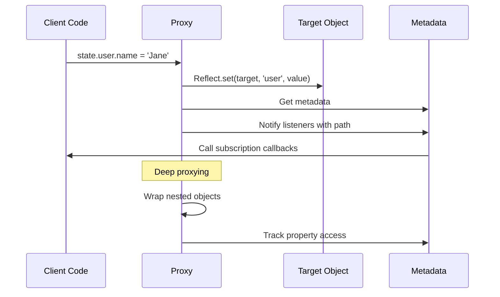
```mermaid
sequenceDiagram
    participant C as Client Code
    participant P as Proxy
    participant T as Target Object
    participant M as Metadata
    
    C->>P: state.user.name = 'Jane'
    P->>T: Reflect.set(target, 'user', value)
    P->>M: Get metadata
    P->>M: Notify listeners with path
    M->>C: Call subscription callbacks
    Note over P: Deep proxying
    P->>P: Wrap nested objects
    P->>M: Track property access
```

### Pub-Sub

Pub-Sub provides event-driven communication between decoupled components. It's perfect for cross-component messaging and real-time data synchronization.

**🔗 [Detailed Pub-Sub Documentation](library/pub-sub/README.md)**

#### How Pub-Sub Works

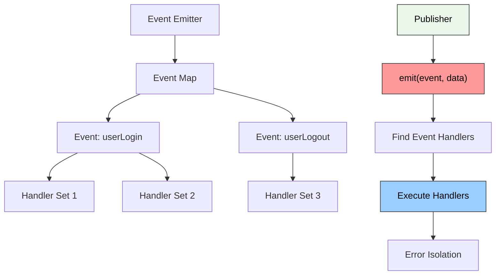
```mermaid
graph TD
    A[Event Emitter] --> B[Event Map]
    B --> C[Event: userLogin]
    B --> D[Event: userLogout]
    C --> E[Handler Set 1]
    C --> F[Handler Set 2]
    D --> G[Handler Set 3]
    
    H[Publisher] --> I["emit(event, data)"]
    I --> J[Find Event Handlers]
    J --> K[Execute Handlers]
    K --> L[Error Isolation]
    
    style H fill:#e8f5e8,stroke:#333,color:#000
    style I fill:#ff9999,stroke:#333,color:#000
    style K fill:#99ccff,stroke:#333,color:#000
```

#### Core Implementation

```typescript
import { 
  createEventEmitter, 
  createReactiveState, 
  createChannel, 
  createPubSubHub,
  combineStates 
} from '@sujeet-pro/reactivity';

// Event emitter
const events = createEventEmitter<{
  userLogin: { userId: string };
  userLogout: void;
}>();

events.on('userLogin', ({ userId }) => {
  console.log(`User ${userId} logged in`);
});

events.emit('userLogin', { userId: '123' });

// Reactive state
const counter = createReactiveState(0);
counter.subscribe(value => console.log(`Counter: ${value}`));
counter.set(prev => prev + 1);

// Channels for namespaced events
const userChannel = createChannel<{ update: any; delete: any }>();
userChannel.publish('update', { id: 1, name: 'Updated' });

// Hub for managing multiple channels
const hub = createPubSubHub();
hub.addChannel('users', userChannel);
hub.getChannel('users')?.subscribe('update', (data) => {
  console.log('User updated:', data);
});

// Combine multiple states
const state1 = createReactiveState(1);
const state2 = createReactiveState(2);
const combined = combineStates({ state1, state2 });
combined.subscribe(({ state1, state2 }) => {
  console.log('Combined:', state1 + state2);
});
```

#### Event Flow Architecture

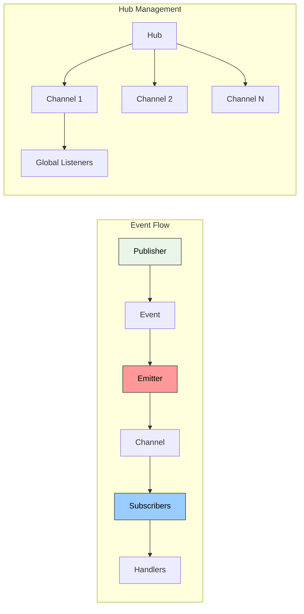
```mermaid
graph LR
    subgraph "Event Flow"
        A[Publisher] --> B[Event]
        B --> C[Emitter]
        C --> D[Channel]
        D --> E[Subscribers]
        E --> F[Handlers]
    end
    
    subgraph "Hub Management"
        G[Hub] --> H[Channel 1]
        G --> I[Channel 2]
        G --> J[Channel N]
        H --> K[Global Listeners]
    end
    
    style A fill:#e8f5e8,stroke:#333,color:#000
    style C fill:#ff9999,stroke:#333,color:#000
    style E fill:#99ccff,stroke:#333,color:#000
```

### RxJS-style

RxJS-style provides functional reactive programming with observable streams and operators. It excels at complex async flows and data transformation pipelines.

**🔗 [Detailed RxJS-style Documentation](library/rxjs-reactive/README.md)**

#### How RxJS-style Works

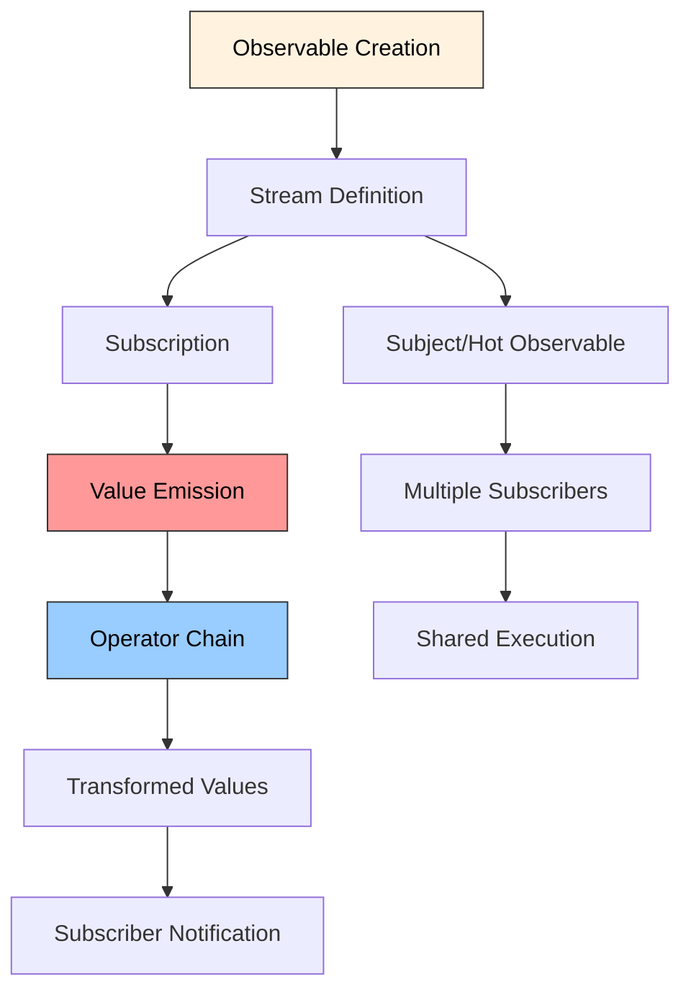
```mermaid
graph TD
    A[Observable Creation] --> B[Stream Definition]
    B --> C[Subscription]
    C --> D[Value Emission]
    D --> E[Operator Chain]
    E --> F[Transformed Values]
    F --> G[Subscriber Notification]
    
    B --> H[Subject/Hot Observable]
    H --> I[Multiple Subscribers]
    I --> J[Shared Execution]
    
    style A fill:#fff3e0,stroke:#333,color:#000
    style D fill:#ff9999,stroke:#333,color:#000
    style E fill:#99ccff,stroke:#333,color:#000
```

#### Core Implementation

```typescript
import { 
  createSubject, 
  createBehaviorSubject,
  createObservable,
  fromArray,
  fromPromise,
  interval,
  timer
} from '@sujeet-pro/reactivity';

// Subject
const clicks$ = createSubject<MouseEvent>();

clicks$
  .map(event => ({ x: event.clientX, y: event.clientY }))
  .filter(coords => coords.x > 100)
  .subscribe(coords => console.log('Click:', coords));

// BehaviorSubject (has current value)
const currentUser$ = createBehaviorSubject({ name: 'Anonymous' });
console.log(currentUser$.value); // { name: 'Anonymous' }

// Observable creation utilities
const numbers$ = fromArray([1, 2, 3, 4, 5]);
numbers$
  .map(x => x * 2)
  .filter(x => x > 4)
  .subscribe(x => console.log(x)); // 6, 8, 10

// Timer observables
const timer$ = interval(1000);
timer$
  .take(5)
  .subscribe(count => console.log(`Timer: ${count}`));

// From promises
const data$ = fromPromise(fetch('/api/data'));
data$
  .map(response => response.json())
  .subscribe(data => console.log('Data:', data));

// One-shot timer
const delayed$ = timer(2000);
delayed$.subscribe(() => console.log('Timer fired after 2 seconds'));
```

#### Observable Stream Flow

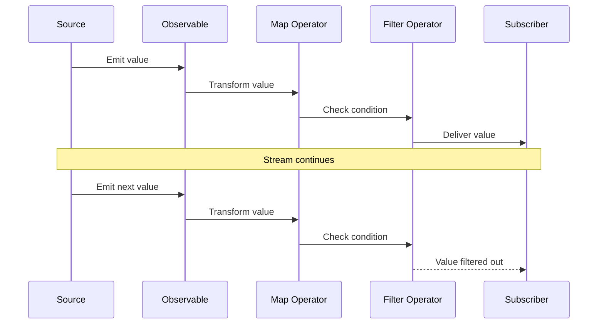
```mermaid
sequenceDiagram
    participant S as Source
    participant O as Observable
    participant M as Map Operator
    participant F as Filter Operator
    participant U as Subscriber
    
    S->>O: Emit value
    O->>M: Transform value
    M->>F: Check condition
    F->>U: Deliver value
    Note over S,U: Stream continues
    S->>O: Emit next value
    O->>M: Transform value
    M->>F: Check condition
    F-->>U: Value filtered out
```

## 🔧 Implementation Details

### Signals Implementation

**🔗 [Full Signals Implementation Details](library/signals/README.md#implementation-details)**

#### Dependency Tracking System

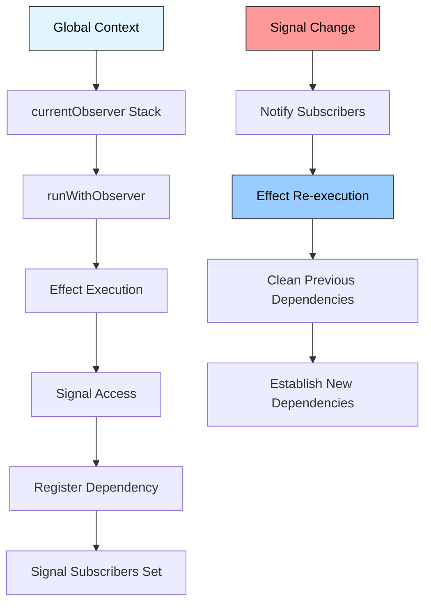
```mermaid
graph TD
    A[Global Context] --> B[currentObserver Stack]
    B --> C[runWithObserver]
    C --> D[Effect Execution]
    D --> E[Signal Access]
    E --> F[Register Dependency]
    F --> G[Signal Subscribers Set]
    
    H[Signal Change] --> I[Notify Subscribers]
    I --> J[Effect Re-execution]
    J --> K[Clean Previous Dependencies]
    K --> L[Establish New Dependencies]
    
    style A fill:#e1f5fe,stroke:#333,color:#000
    style H fill:#ff9999,stroke:#333,color:#000
    style J fill:#99ccff,stroke:#333,color:#000
```

#### Memory Management

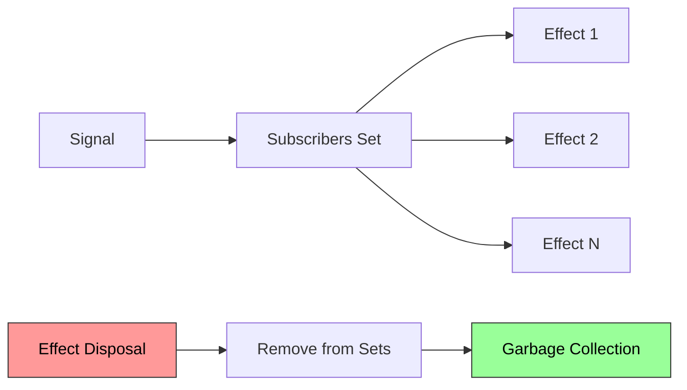
```mermaid
graph LR
    A[Signal] --> B[Subscribers Set]
    B --> C[Effect 1]
    B --> D[Effect 2]
    B --> E[Effect N]
    
    F[Effect Disposal] --> G[Remove from Sets]
    G --> H[Garbage Collection]
    
    style F fill:#ff9999,stroke:#333,color:#000
    style H fill:#99ff99,stroke:#333,color:#000
```

### Proxy State Implementation

**🔗 [Full Proxy State Implementation Details](library/proxy-state/README.md#implementation-details)**

#### Proxy Trap Architecture

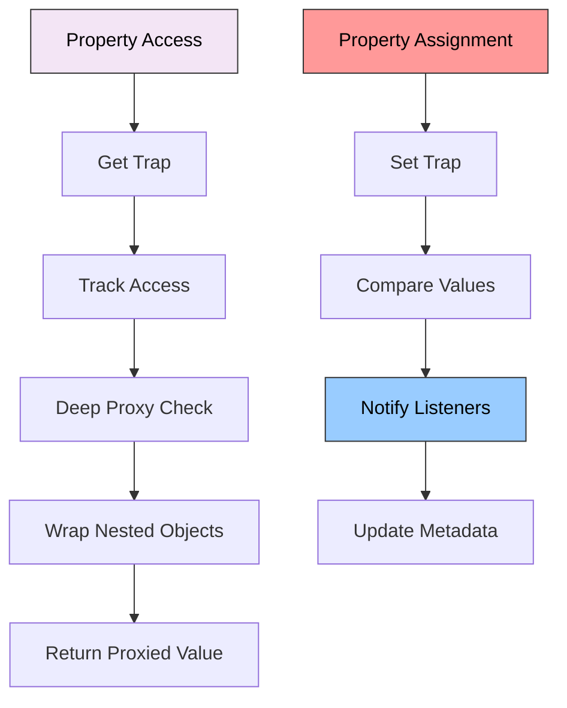
```mermaid
graph TD
    A[Property Access] --> B[Get Trap]
    B --> C[Track Access]
    C --> D[Deep Proxy Check]
    D --> E[Wrap Nested Objects]
    E --> F[Return Proxied Value]
    
    G[Property Assignment] --> H[Set Trap]
    H --> I[Compare Values]
    I --> J[Notify Listeners]
    J --> K[Update Metadata]
    
    style A fill:#f3e5f5,stroke:#333,color:#000
    style G fill:#ff9999,stroke:#333,color:#000
    style J fill:#99ccff,stroke:#333,color:#000
```

#### Batching System

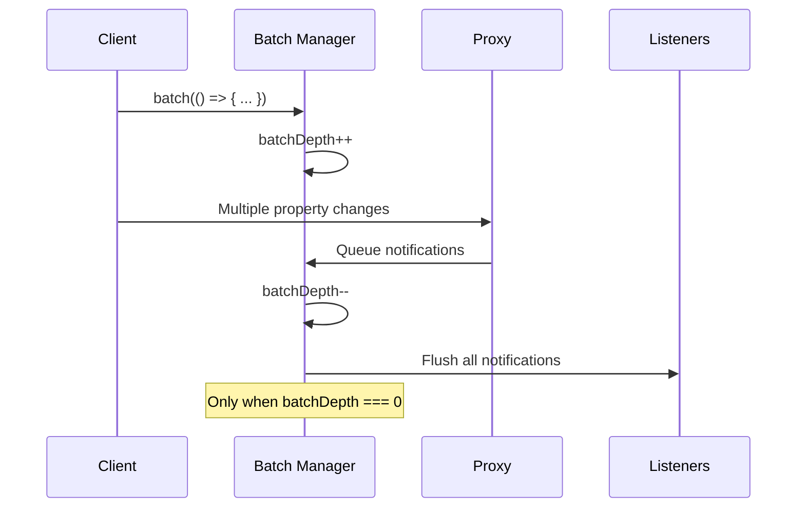
```mermaid
sequenceDiagram
    participant C as Client
    participant B as Batch Manager
    participant P as Proxy
    participant L as Listeners
    
    C->>B: batch(() => { ... })
    B->>B: batchDepth++
    C->>P: Multiple property changes
    P->>B: Queue notifications
    B->>B: batchDepth--
    B->>L: Flush all notifications
    Note over B: Only when batchDepth === 0
```

### Pub-Sub Implementation

**🔗 [Full Pub-Sub Implementation Details](library/pub-sub/README.md#implementation-details)**

#### Event Flow Architecture


```mermaid
graph TD
    A[Event Emitter] --> B[Event Map]
    B --> C[Event: userLogin]
    B --> D[Event: userLogout]
    C --> E[Handler Set 1]
    C --> F[Handler Set 2]
    D --> G[Handler Set 3]
    
    H[Publisher] --> I["emit(event, data)"]
    I --> J[Find Event Handlers]
    J --> K[Execute Handlers]
    K --> L[Error Isolation]
    
    style H fill:#e8f5e8,stroke:#333,color:#000
    style I fill:#ff9999,stroke:#333,color:#000
    style K fill:#99ccff,stroke:#333,color:#000
```

#### Channel and Hub Management

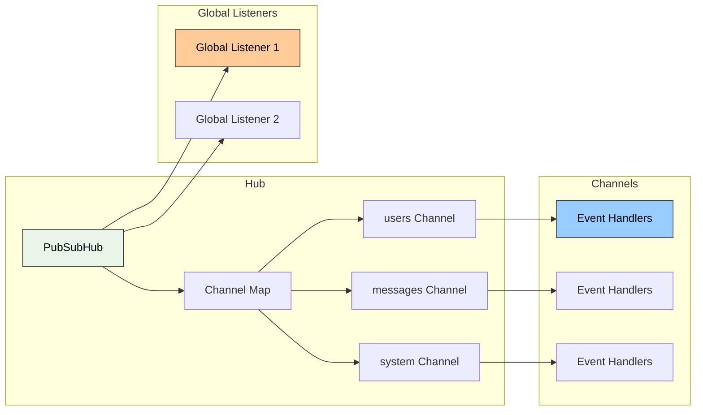
```mermaid
graph LR
    subgraph "Hub"
        A[PubSubHub] --> B[Channel Map]
        B --> C[users Channel]
        B --> D[messages Channel]
        B --> E[system Channel]
    end
    
    subgraph "Channels"
        C --> F[Event Handlers]
        D --> G[Event Handlers]
        E --> H[Event Handlers]
    end
    
    subgraph "Global Listeners"
        I[Global Listener 1]
        J[Global Listener 2]
    end
    
    A --> I
    A --> J
    
    style A fill:#e8f5e8,stroke:#333,color:#000
    style F fill:#99ccff,stroke:#333,color:#000
    style I fill:#ffcc99,stroke:#333,color:#000
```

### RxJS-style Implementation

**🔗 [Full RxJS-style Implementation Details](library/rxjs-reactive/README.md#implementation-details)**

#### Observable Chain Architecture

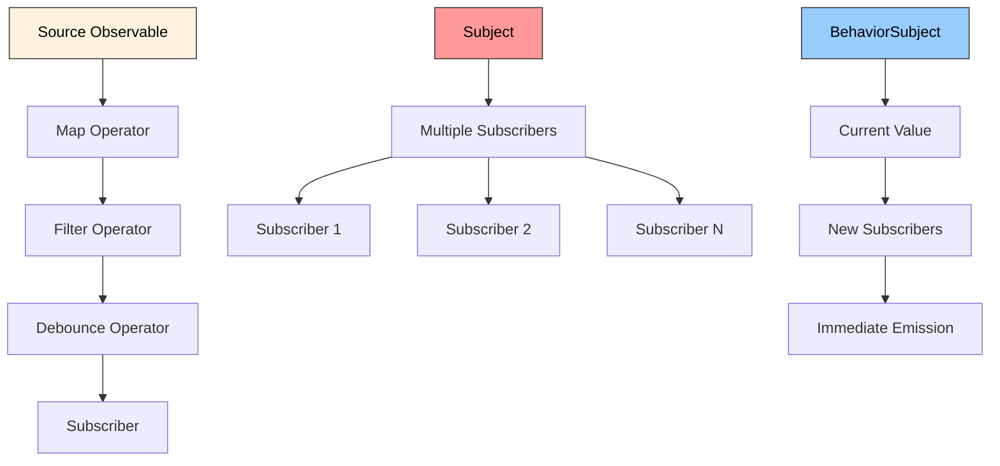
```mermaid
graph TD
    A[Source Observable] --> B[Map Operator]
    B --> C[Filter Operator]
    C --> D[Debounce Operator]
    D --> E[Subscriber]
    
    F[Subject] --> G[Multiple Subscribers]
    G --> H[Subscriber 1]
    G --> I[Subscriber 2]
    G --> J[Subscriber N]
    
    K[BehaviorSubject] --> L[Current Value]
    L --> M[New Subscribers]
    M --> N[Immediate Emission]
    
    style A fill:#fff3e0,stroke:#333,color:#000
    style F fill:#ff9999,stroke:#333,color:#000
    style K fill:#99ccff,stroke:#333,color:#000
```

#### Operator Implementation Flow

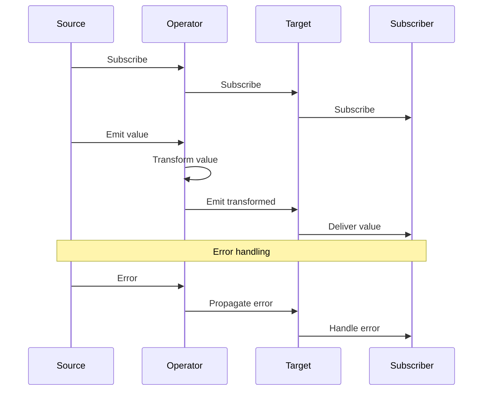
```mermaid
sequenceDiagram
    participant S as Source
    participant O as Operator
    participant T as Target
    participant U as Subscriber
    
    S->>O: Subscribe
    O->>T: Subscribe
    T->>U: Subscribe
    
    S->>O: Emit value
    O->>O: Transform value
    O->>T: Emit transformed
    T->>U: Deliver value
    
    Note over S,U: Error handling
    S->>O: Error
    O->>T: Propagate error
    T->>U: Handle error
```

## 🎯 Examples

The examples application demonstrates all four reactivity patterns with interactive counter implementations. Each pattern shows:

- Counter state management
- Event handling
- Performance metrics (effect runs, updates, events, emissions)
- Real-time updates
- Advanced patterns and combinations

The examples are built as a single HTML file for easy deployment and sharing.

Visit the [examples page](https://sujeet-pro.github.io/reactivity/) to see them in action.

## 🧪 Testing

The library includes comprehensive tests using Vitest:

- Unit tests for all reactive patterns (268+ tests for signals, 712+ for proxy state, 532+ for pub-sub, 1499+ for RxJS)
- Integration tests for complex scenarios
- Performance benchmarks
- Edge case coverage
- Coverage reporting with v8 provider

## 🎨 Implementation Details

### Signals
- Automatic dependency tracking using execution context
- Synchronous updates with proper cleanup
- Memory-efficient subscriber management
- Equality checking for optimization
- Resource handling for async operations

**🔗 [Complete Signals Documentation](library/signals/README.md)**

### Proxy State  
- Deep reactivity using JavaScript Proxies
- Path-based change notifications with full path tracking
- Nested object support with proper cleanup
- Computed states that automatically update
- Batching support for performance optimization
- Immutable update patterns with updateProxyState

**🔗 [Complete Proxy State Documentation](library/proxy-state/README.md)**

### Pub-Sub
- Type-safe event emitters with strong typing
- Memory leak prevention with proper cleanup
- Error handling and recovery mechanisms
- Flexible subscription management
- Channel-based organization for namespaced events
- Hub pattern for managing multiple channels
- State combination utilities

**🔗 [Complete Pub-Sub Documentation](library/pub-sub/README.md)**

### RxJS-style
- Full operator support (map, filter, debounce, take, etc.)
- Subject and BehaviorSubject implementations
- Observable creation utilities (fromArray, fromPromise, interval, timer)
- Subscription management with automatic cleanup
- Error handling with retry logic
- Backpressure handling for high-frequency events

**🔗 [Complete RxJS-style Documentation](library/rxjs-reactive/README.md)**

## 🚀 Performance Best Practices

### Signal Usage
- Keep signal values as small as possible
- Use `createMemo` for expensive computations
- Avoid creating signals inside effects or loops
- Use `batch` operations for multiple state updates
- Consider using custom equality functions for complex objects

### Memory Management
- Dispose effects when they're no longer needed
- Clean up resources in effect cleanup functions
- Use weak references for caching when appropriate
- Avoid circular dependencies between signals

### Optimization Tips
- Use `createMemo` instead of computing values in effects
- Split large effects into smaller, focused ones
- Leverage TypeScript for better type safety and IDE support
- Profile your application using the built-in development tools

## 🤝 Contributing

We welcome contributions! Here's how you can help:

### Setting up Development Environment

1. Fork the repository
2. Clone your fork
3. Install dependencies: `npm install`
4. Create a feature branch: `git checkout -b feature/your-feature`

### Development Workflow

1. Make your changes
2. Add tests for new functionality
3. Run tests: `npm test`
4. Run type checks: `npm run type-check`
5. Run linting: `npm run lint`
6. Build the library: `npm run build`

### Commit Guidelines

We follow the [Conventional Commits](https://www.conventionalcommits.org/) specification:

- `feat:` New features
- `fix:` Bug fixes
- `docs:` Documentation changes
- `perf:` Performance improvements
- `refactor:` Code refactoring
- `test:` Adding or updating tests

### Pull Request Process

1. Update documentation for new features
2. Add tests for new functionality
3. Ensure all tests pass
4. Update the CHANGELOG.md file
5. Request review from maintainers

### Code Style

- Follow TypeScript best practices
- Use meaningful variable and function names
- Add JSDoc comments for public APIs
- Keep functions small and focused
- Write unit tests for new features

## 📄 License

This project is licensed under the ISC License - see the [LICENSE](LICENSE) file for details.

## 🙏 Acknowledgments

- Inspired by [SolidJS](https://solidjs.com) signals implementation
- [RxJS](https://rxjs.dev) for observable patterns
- [Vue.js](https://vuejs.org) for proxy-based reactivity concepts

## 🔗 Links

- [GitHub Repository](https://github.com/sujeet-pro/reactivity)
- [Live Examples](https://projects.sujeet.pro/reactivity/)
- [Documentation](https://github.com/sujeet-pro/reactivity#readme)

---

**📚 Navigation:**
- **[Signals Implementation](library/signals/README.md)** - Fine-grained reactivity with automatic dependency tracking
- **[Proxy State Implementation](library/proxy-state/README.md)** - Object mutation tracking using JavaScript Proxies
- **[Pub-Sub Implementation](library/pub-sub/README.md)** - Event-driven architecture with publishers and subscribers
- **[RxJS-style Implementation](library/rxjs-reactive/README.md)** - Observable streams with functional operators