# Proxy State Implementation

## 📚 Navigation

**🧠 [Main Documentation](../../README.md)** - Overview of all reactivity patterns

**📖 Individual Pattern Documentation:**
- **[Signals Implementation](../signals/README.md)** - Fine-grained reactivity with automatic dependency tracking
- **[Proxy State Implementation](README.md)** - Object mutation tracking using JavaScript Proxies (you are here)
- **[Pub-Sub Implementation](../pub-sub/README.md)** - Event-driven architecture with publishers and subscribers
- **[RxJS-style Implementation](../rxjs-reactive/README.md)** - Observable streams with functional operators

**🔗 Quick Links:**
- [Examples](../../examples/) - Interactive examples and demos
- [API Reference](../) - Complete API documentation
- [Tests](proxy-state.test.ts) - Test suite for proxy state
- [Performance Benchmarks](../benchmarks/) - Performance comparisons

---

## 🧠 The Idea Behind Proxy State

Proxy State represents a **transparent reactivity paradigm** where objects become reactive through JavaScript Proxies, enabling automatic change detection without requiring special syntax or manual tracking. The core philosophy is:

1. **Transparent Mutations**: Objects behave exactly like normal JavaScript objects
2. **Deep Reactivity**: Changes to nested properties are automatically tracked
3. **Path-Based Notifications**: Know exactly what changed and where in the object tree
4. **Immutable Snapshots**: Maintain clean state copies for time-travel debugging

This approach provides Vue.js-style reactivity where developers can work with familiar object mutation patterns while gaining automatic change detection. The proxy layer intercepts all property access, modification, and deletion operations.

### Proxy State Architecture Overview


## 🎯 Use Cases

### When to Choose Proxy State

**✅ Perfect for:**
- **Form Management**: Complex forms with nested data structures and validation
- **State Trees**: Applications with hierarchical state (file systems, organization charts)
- **Configuration Management**: Settings objects with nested categories and options
- **Data Models**: Working with API responses that have complex nested structures
- **Rapid Prototyping**: When you want reactive behavior without changing existing object code
- **Legacy Integration**: Adding reactivity to existing codebases with minimal refactoring

**❌ Consider alternatives for:**
- **High-Frequency Updates**: Proxy overhead can impact performance in tight loops
- **Primitive Values**: Signals are more efficient for simple values
- **Functional Approaches**: If you prefer immutable update patterns
- **Memory-Constrained Environments**: Proxy metadata adds memory overhead

**🔗 Compare with other patterns:**
- **[Signals](../signals/README.md)** - Better for primitive values and high-frequency updates
- **[Pub-Sub](../pub-sub/README.md)** - Better for event-driven communication
- **[RxJS-style](../rxjs-reactive/README.md)** - Better for complex async flows

### Proxy State Usage Patterns


### Specific Use Case Examples

#### 1. Complex Form State Management
```typescript
const formState = createProxyState({
  personal: {
    firstName: '',
    lastName: '',
    email: '',
    address: {
      street: '',
      city: '',
      state: '',
      zipCode: ''
    }
  },
  preferences: {
    newsletter: false,
    notifications: {
      email: true,
      sms: false,
      push: true
    }
  },
  validation: {
    errors: {},
    touched: {},
    isValid: true
  }
});

// Track all changes with full path information
formState.__subscribe((newState, oldState, path) => {
  console.log(`Changed ${path.join('.')}: ${newState} (was ${oldState})`);
  
  // Validate the specific field that changed
  if (path[0] === 'personal') {
    validateField(path.slice(1).join('.'), newState);
  }
  
  // Auto-save on any change
  debounce(() => saveFormDraft(formState.__getSnapshot()), 1000);
});

// Natural object mutation works seamlessly
formState.personal.firstName = 'John';
formState.personal.address.city = 'New York';
formState.preferences.notifications.email = false;
```

#### 2. Application State Tree
```typescript
const appState = createProxyState({
  user: {
    profile: {
      id: null,
      name: '',
      avatar: '',
      preferences: {
        theme: 'light',
        language: 'en',
        timezone: 'UTC'
      }
    },
    permissions: {
      canEdit: false,
      canDelete: false,
      canAdmin: false
    }
  },
  ui: {
    navigation: {
      currentRoute: '/',
      breadcrumbs: [],
      sidebarOpen: false
    },
    modals: {
      activeModal: null,
      modalData: {}
    },
    notifications: []
  },
  data: {
    entities: {
      users: {},
      posts: {},
      comments: {}
    },
    loading: {},
    errors: {}
  }
});

// Global state change handler
appState.__subscribe((newValue, oldValue, path) => {
  // Route changes
  if (path.join('.') === 'ui.navigation.currentRoute') {
    handleRouteChange(newValue);
  }
  
  // User permission changes
  if (path[0] === 'user' && path[1] === 'permissions') {
    updateUIBasedOnPermissions(appState.user.permissions);
  }
  
  // Data loading states
  if (path[0] === 'data' && path[1] === 'loading') {
    updateLoadingUI(path[2], newValue);
  }
});
```

#### 3. Configuration Management System
```typescript
const configState = createProxyState({
  database: {
    host: 'localhost',
    port: 5432,
    credentials: {
      username: '',
      password: ''
    },
    pool: {
      min: 2,
      max: 10,
      idleTimeoutMillis: 30000
    }
  },
  api: {
    baseURL: 'https://api.example.com',
    timeout: 5000,
    retries: 3,
    auth: {
      type: 'bearer',
      token: ''
    }
  },
  features: {
    enableFeatureA: false,
    enableFeatureB: true,
    betaFeatures: {
      newUI: false,
      advancedAnalytics: true
    }
  }
});

// Auto-sync configuration changes
configState.__subscribe((newValue, oldValue, path) => {
  // Save to persistent storage
  localStorage.setItem('appConfig', JSON.stringify(configState.__getSnapshot()));
  
  // Apply configuration changes
  if (path[0] === 'database') {
    reconnectDatabase(configState.database);
  }
  
  if (path[0] === 'api') {
    updateApiClient(configState.api);
  }
  
  if (path[0] === 'features') {
    toggleFeatures(path.slice(1), newValue);
  }
});
```

## 🔧 Implementation Details

### Core Architecture

#### 1. Proxy Trap Handlers


```typescript
const proxyTraps: ProxyHandler<any> = {
  get(target, property, receiver) {
    const value = Reflect.get(target, property, receiver);
    
    // Track property access for dependency tracking
    if (typeof property === 'string' && property !== '__meta') {
      trackAccess(target, property);
    }
    
    // Deep proxying: wrap nested objects/arrays
    if (isObject(value) && !isProxy(value)) {
      return createNestedProxy(value, [...currentPath, property]);
    }
    
    return value;
  },
  
  set(target, property, value, receiver) {
    const oldValue = target[property];
    const success = Reflect.set(target, property, value, receiver);
    
    if (success && oldValue !== value) {
      // Notify subscribers of the change
      notifyChange(target, property, value, oldValue);
    }
    
    return success;
  },
  
  deleteProperty(target, property) {
    const oldValue = target[property];
    const success = Reflect.deleteProperty(target, property);
    
    if (success) {
      notifyChange(target, property, undefined, oldValue);
    }
    
    return success;
  }
};
```

**Key design decisions:**
- **Reflect API usage**: Maintains proper JavaScript semantics
- **Deep proxying**: Automatically wraps nested objects and arrays
- **Property access tracking**: Enables computed state dependencies
- **Change notifications**: Immediate propagation with full path context

#### 2. Metadata Management


```typescript
// WeakMap-based metadata storage to prevent memory leaks
const proxyMetadata = new WeakMap<object, StateMetadata>();

interface StateMetadata {
  listeners: Set<StateListener>;
  path: string[];
  parent: any;
  originalObject: any;
  computed: Map<string, ComputedState>;
}

function getMetadata(obj: any): StateMetadata | undefined {
  return proxyMetadata.get(obj);
}

function setMetadata(obj: any, metadata: StateMetadata): void {
  proxyMetadata.set(obj, metadata);
}
```

**Metadata structure:**
- **WeakMap storage**: Prevents memory leaks from proxy references
- **Path tracking**: Maintains full object path for precise notifications
- **Listener sets**: Manages subscription callbacks efficiently
- **Parent references**: Enables upward traversal for nested updates
- **Computed states**: Tracks derived values for automatic updates

#### 3. Subscription System


```typescript
export function createProxyState<T extends object>(
  initialState: T,
  options: StateOptions = {}
): ProxyState<T> {
  const { equals = Object.is } = options;
  const listeners = new Set<StateListener>();
  
  function subscribe(listener: StateListener): () => void {
    listeners.add(listener);
    return () => listeners.delete(listener);
  }
  
  function notifyListeners(newValue: any, oldValue: any, path: string[]) {
    if (!equals(newValue, oldValue)) {
      for (const listener of listeners) {
        try {
          listener(newValue, oldValue, path);
        } catch (error) {
          console.error('Error in state listener:', error);
        }
      }
    }
  }
  
  const proxy = new Proxy(initialState, {
    // Proxy traps implementation
  });
  
  // Attach metadata and methods
  Object.defineProperty(proxy, '__subscribe', {
    value: subscribe,
    writable: false,
    enumerable: false,
    configurable: false
  });
  
  return proxy as ProxyState<T>;
}
```

#### 4. Computed State Implementation


```typescript
export function createComputedState<T extends readonly any[], R>(
  dependencies: T,
  compute: (...args: T) => R,
  options?: ComputedStateOptions
): ComputedState<R> {
  let cachedValue: R;
  let isStale = true;
  const listeners = new Set<StateListener>();
  
  const computedState = () => {
    if (isStale) {
      cachedValue = compute(...dependencies);
      isStale = false;
    }
    return cachedValue;
  };
  
  // Subscribe to all dependencies
  const unsubscribers = dependencies.map(dep => {
    if (dep && typeof dep.__subscribe === 'function') {
      return dep.__subscribe(() => {
        const oldValue = cachedValue;
        isStale = true;
        const newValue = computedState();
        
        notifyListeners(newValue, oldValue);
      });
    }
    return () => {};
  });
  
  // Initial computation
  computedState();
  
  return {
    get value() { return computedState(); },
    subscribe: (listener) => {
      listeners.add(listener);
      return () => listeners.delete(listener);
    },
    dispose: () => {
      unsubscribers.forEach(unsub => unsub());
      listeners.clear();
    }
  };
}
```

#### 5. Batch Update System


```typescript
let batchDepth = 0;
let batchedNotifications: Array<{
  listeners: Set<StateListener>;
  newValue: any;
  oldValue: any;
  path: string[];
}> = [];

export function batch<T>(fn: () => T): T {
  batchDepth++;
  
  try {
    const result = fn();
    
    // If this is the outermost batch, flush all notifications
    if (batchDepth === 1) {
      flushBatchedNotifications();
    }
    
    return result;
  } finally {
    batchDepth--;
  }
}

function flushBatchedNotifications() {
  const notifications = batchedNotifications.slice();
  batchedNotifications.length = 0;
  
  // Group notifications by listener to avoid duplicate calls
  const listenerNotifications = new Map<StateListener, Array<NotificationData>>();
  
  for (const notification of notifications) {
    for (const listener of notification.listeners) {
      if (!listenerNotifications.has(listener)) {
        listenerNotifications.set(listener, []);
      }
      listenerNotifications.get(listener)!.push(notification);
    }
  }
  
  // Execute each listener once with all its notifications
  for (const [listener, notifications] of listenerNotifications) {
    try {
      listener(notifications);
    } catch (error) {
      console.error('Error in batched state listener:', error);
    }
  }
}
```

### Advanced Features

#### 1. Immutable Update Patterns


```typescript
export function updateProxyState<T>(
  state: ProxyState<T>,
  updater: (draft: T) => T | void
): void {
  const snapshot = state.__getSnapshot();
  const result = updater(snapshot);
  
  if (result !== undefined) {
    // Replace entire state
    Object.assign(state, result);
  } else {
    // Apply changes from draft
    applyChanges(state, snapshot);
  }
}

function applyChanges(target: any, draft: any, path: string[] = []): void {
  for (const key in draft) {
    if (target[key] !== draft[key]) {
      if (isObject(draft[key]) && isObject(target[key])) {
        applyChanges(target[key], draft[key], [...path, key]);
      } else {
        target[key] = draft[key];
      }
    }
  }
}
```

#### 2. Multi-State Coordination


```typescript
export function subscribeToStates<T extends readonly ProxyState<any>[]>(
  states: T,
  listener: (changedState: T[number], newValue: any, oldValue: any, path: string[]) => void
): () => void {
  const unsubscribers = states.map(state => 
    state.__subscribe((newValue, oldValue, path) => {
      listener(state, newValue, oldValue, path);
    })
  );
  
  return () => {
    unsubscribers.forEach(unsub => unsub());
  };
}
```

#### 3. Time-Travel Debugging


```typescript
class StateHistory<T> {
  private history: T[] = [];
  private currentIndex = -1;
  
  constructor(private state: ProxyState<T>) {
    this.saveSnapshot();
    
    state.__subscribe(() => {
      this.saveSnapshot();
    });
  }
  
  private saveSnapshot(): void {
    const snapshot = this.state.__getSnapshot();
    this.history = this.history.slice(0, this.currentIndex + 1);
    this.history.push(snapshot);
    this.currentIndex = this.history.length - 1;
  }
  
  undo(): boolean {
    if (this.currentIndex > 0) {
      this.currentIndex--;
      updateProxyState(this.state, () => this.history[this.currentIndex]);
      return true;
    }
    return false;
  }
  
  redo(): boolean {
    if (this.currentIndex < this.history.length - 1) {
      this.currentIndex++;
      updateProxyState(this.state, () => this.history[this.currentIndex]);
      return true;
    }
    return false;
  }
}
```

### Performance Characteristics

#### 1. Time Complexity

```mermaid
graph LR
    A[Property Access] --> B[O(1) + Proxy Overhead]
    C[Property Assignment] --> D[O(1) + Notifications]
    E[Deep Property Access] --> F[O(d) where d = depth]
    G[Snapshot Creation] --> H[O(m) where m = properties]
    
    subgraph "Overhead"
        B
        D
    end
    
    style A fill:#99ccff,stroke:#333,color:#000
    style C fill:#ff9999,stroke:#333,color:#000
    style E fill:#ffcc99,stroke:#333,color:#000
    style G fill:#99ff99,stroke:#333,color:#000
```

- **Property access**: O(1) + proxy overhead (~2-3x slower than direct access)
- **Property assignment**: O(1) + notification overhead O(n) where n = subscribers
- **Deep property access**: O(d) where d = nesting depth
- **Snapshot creation**: O(m) where m = total properties in object tree

#### 2. Memory Usage


- **Proxy overhead**: ~200-300 bytes per proxied object
- **Metadata storage**: ~100 bytes per object in WeakMap
- **Deep proxying**: Memory usage scales with object complexity
- **Snapshot storage**: Full object copy for each snapshot

#### 3. Performance Optimizations


```typescript
// Lazy proxying - only proxy when accessed
const lazyProxy = new Proxy(target, {
  get(target, property) {
    if (!proxyCache.has(target[property])) {
      proxyCache.set(target[property], createProxy(target[property]));
    }
    return proxyCache.get(target[property]);
  }
});

// Path-based equality checking
function shouldNotify(newValue: any, oldValue: any, path: string[]): boolean {
  // Skip notifications for certain paths
  if (path.includes('_internal') || path.includes('_cache')) {
    return false;
  }
  
  // Custom equality for objects
  if (isObject(newValue) && isObject(oldValue)) {
    return !deepEqual(newValue, oldValue);
  }
  
  return newValue !== oldValue;
}
```

### Memory Management

#### 1. Automatic Cleanup


```typescript
// WeakMap ensures garbage collection of orphaned objects
const proxyMetadata = new WeakMap();

// Cleanup computed states when dependencies are garbage collected
class ComputedState {
  private cleanupTimer: number;
  
  constructor() {
    // Auto-cleanup after period of inactivity
    this.cleanupTimer = setTimeout(() => {
      this.dispose();
    }, 60000);
  }
  
  access() {
    clearTimeout(this.cleanupTimer);
    this.resetCleanupTimer();
  }
}
```

#### 2. Memory Leak Prevention

```mermaid
graph LR
    A[❌ Circular Reference] --> B[Memory Leak]
    C[✅ ID References] --> D[Proper Cleanup]
    D --> E[Garbage Collection]
    
    style A fill:#ff9999,stroke:#333,color:#000
    style C fill:#99ff99,stroke:#333,color:#000
    style E fill:#99ccff,stroke:#333,color:#000
```



```typescript
// ❌ Memory leak - circular reference
const parent = createProxyState({ children: [] });
const child = createProxyState({ parent });
parent.children.push(child);

// ✅ Proper pattern - use IDs for references
const parent = createProxyState({ children: ['child1'] });
const child = createProxyState({ parentId: 'parent1' });
```

### Error Handling

#### 1. Graceful Degradation


```typescript
function safeProxy<T>(target: T): T {
  try {
    return new Proxy(target, proxyTraps);
  } catch (error) {
    console.warn('Proxy not supported, falling back to direct object:', error);
    return target;
  }
}
```

#### 2. Listener Error Isolation


```typescript
function notifyListeners(newValue: any, oldValue: any, path: string[]) {
  for (const listener of listeners) {
    try {
      listener(newValue, oldValue, path);
    } catch (error) {
      console.error(`Error in state listener for path ${path.join('.')}:`, error);
      // Continue with other listeners
    }
  }
}
```

### Best Practices

#### 1. State Structure Design

```mermaid
graph TD
    A[❌ Too Deep Nesting] --> B[Deep Object Tree]
    B --> C[Performance Issues]
    C --> D[Hard to Debug]
    
    E[✅ Flatter Structure] --> F[Normalized State]
    F --> G[Better Performance]
    G --> H[Easier Debugging]
    
    style A fill:#ff9999,stroke:#333,color:#000
    style E fill:#99ff99,stroke:#333,color:#000
    style C fill:#ffcc99,stroke:#333,color:#000
    style G fill:#99ccff,stroke:#333,color:#000
```



```typescript
// ❌ Too deep nesting
const badState = createProxyState({
  app: {
    modules: {
      user: {
        profile: {
          personal: {
            details: {
              name: {
                first: 'John',
                last: 'Doe'
              }
            }
          }
        }
      }
    }
  }
});

// ✅ Flatter structure
const goodState = createProxyState({
  userProfile: {
    firstName: 'John',
    lastName: 'Doe'
  },
  userSettings: {
    theme: 'dark'
  },
  appConfig: {
    module: 'user'
  }
});
```

#### 2. Subscription Granularity

```mermaid
graph TD
    A[❌ Over-subscribing] --> B[All Changes Handler]
    B --> C[Process Irrelevant Changes]
    C --> D[Performance Impact]
    
    E[✅ Targeted Subscriptions] --> F[Path-based Filtering]
    F --> G[Process Only Relevant Changes]
    G --> H[Better Performance]
    
    style A fill:#ff9999,stroke:#333,color:#000
    style E fill:#99ff99,stroke:#333,color:#000
    style D fill:#ffcc99,stroke:#333,color:#000
    style H fill:#99ccff,stroke:#333,color:#000
```



```typescript
// ❌ Over-subscribing
state.__subscribe((newValue, oldValue, path) => {
  // Handles all changes, even irrelevant ones
  handleAnyChange(newValue, oldValue, path);
});

// ✅ Targeted subscriptions
state.__subscribe((newValue, oldValue, path) => {
  if (path[0] === 'user') {
    handleUserChange(newValue, oldValue, path.slice(1));
  } else if (path[0] === 'ui') {
    handleUIChange(newValue, oldValue, path.slice(1));
  }
});
```

#### 3. Performance Optimization


```typescript
// Use batch updates for multiple changes
batch(() => {
  state.user.firstName = 'John';
  state.user.lastName = 'Doe';
  state.user.email = 'john@example.com';
}); // Only one notification sent

// Use computed states for expensive calculations
const expensiveComputation = createComputedState(
  [state.data.items],
  (items) => items.filter(item => item.category === 'important').length
);
```

This proxy state implementation provides powerful object-oriented reactivity with minimal API surface while maintaining the familiar JavaScript object manipulation patterns developers expect.

## Key Features

- **Deep reactivity**: Automatically tracks nested object and array changes
- **Path-based notifications**: Know exactly what changed and where
- **Immutable snapshots**: Get clean copies of state at any time  
- **Memory efficient**: Minimal overhead with automatic cleanup
- **Type safety**: Full TypeScript support with proper type inference

## Core Concepts

### Proxy State
Creates a reactive proxy wrapper around any object that tracks all mutations.

```typescript
const state = createProxyState({
  user: {
    name: 'John',
    profile: {
      age: 30,
      preferences: {
        theme: 'dark',
        notifications: true
      }
    }
  },
  todos: [
    { id: 1, text: 'Learn React', done: false },
    { id: 2, text: 'Build app', done: true }
  ]
});

// Subscribe to any changes
state.__subscribe((newState, oldState, path) => {
  console.log(`Changed at [${path.join('.')}]:`, newState);
});

// All mutations are tracked
state.user.name = 'Jane';                    // Triggers: ['user', 'name']
state.user.profile.age = 31;                // Triggers: ['user', 'profile', 'age'] 
state.todos.push({ id: 3, text: 'Deploy', done: false }); // Triggers: ['todos', '2']
```

### State Updates
Helper function for immutable-style updates while maintaining reactivity.

```typescript
// Functional updates
updateProxyState(state, current => ({
  user: {
    ...current.user,
    profile: {
      ...current.user.profile,
      age: current.user.profile.age + 1
    }
  }
}));

// Partial updates
updateProxyState(state, {
  'user.name': 'Alice',
  'todos[0].done': true
});
```

### Computed State
Create derived state that automatically recomputes when dependencies change.

```typescript
const userAge = createComputedState(() => state.user.profile.age);

userAge.subscribe(age => {
  console.log(`User age changed to: ${age}`);
});

// Changing the source triggers the computed
state.user.profile.age = 32; // Logs: "User age changed to: 32"
```

## Implementation Details

1. **Proxy Traps**: Uses get/set/deleteProperty traps to intercept mutations
2. **Deep Proxying**: Automatically wraps nested objects and arrays
3. **Path Tracking**: Maintains full path information for precise change notifications
4. **Memory Management**: WeakMap-based metadata storage prevents leaks
5. **Equality Checking**: Configurable equality functions to optimize updates

## Usage Examples

### Basic Object Tracking

```typescript
import { createProxyState } from './proxy-state';

const appState = createProxyState({
  ui: {
    theme: 'light',
    sidebar: { open: false, width: 250 },
    modals: []
  },
  data: {
    users: [],
    posts: [],
    cache: new Map()
  }
});

// Subscribe to specific changes
appState.__subscribe((newState, oldState, path) => {
  if (path[0] === 'ui') {
    updateUI(newState.ui);
  } else if (path[0] === 'data') {
    syncToServer(path, newState);
  }
});

// Direct mutations work naturally
appState.ui.theme = 'dark';
appState.ui.sidebar.open = true;
appState.data.users.push({ id: 1, name: 'John' });
```

### Form State Management

```typescript
const formState = createProxyState({
  values: {
    email: '',
    password: '',
    profile: {
      firstName: '',
      lastName: '',
      bio: ''
    }
  },
  errors: {},
  touched: {},
  isSubmitting: false
});

// Validation on change
formState.__subscribe((newState, oldState, path) => {
  if (path[0] === 'values') {
    const field = path.slice(1).join('.');
    formState.errors[field] = validateField(field, newState.values);
    formState.touched[field] = true;
  }
});

// Natural form binding
function handleChange(field: string, value: string) {
  // Works with nested paths
  setNestedValue(formState.values, field, value);
}
```

### State Persistence

```typescript
const persistentState = createProxyState(
  loadFromStorage() || { settings: {}, data: {} }
);

// Auto-save on changes
let saveTimeout: number;
persistentState.__subscribe((newState) => {
  clearTimeout(saveTimeout);
  saveTimeout = setTimeout(() => {
    saveToStorage(newState);
  }, 1000);
});

// Batch updates to minimize saves
batch(() => {
  persistentState.settings.theme = 'dark';
  persistentState.settings.language = 'en';
  persistentState.data.lastSeen = Date.now();
});
```

### Multiple State Coordination

```typescript
const userState = createProxyState({ 
  currentUser: null, 
  preferences: {} 
});

const appState = createProxyState({ 
  route: '/', 
  loading: false 
});

// Coordinate multiple states
subscribeToStates([userState, appState], (changedState, newValue, oldValue, path) => {
  if (changedState === userState && path.includes('currentUser')) {
    // User changed, update app state
    appState.loading = true;
    loadUserData(newValue.currentUser).then(() => {
      appState.loading = false;
    });
  }
});
```

## Advanced Features

### Custom Equality Checking

```typescript
const state = createProxyState(
  { items: [] },
  { 
    equals: (a, b) => JSON.stringify(a) === JSON.stringify(b) // Deep equality
  }
);
```

### Batch Updates

```typescript
// Defer notifications until batch completes
batch(() => {
  state.user.name = 'New Name';
  state.user.email = 'new@email.com';
  state.user.profile.age = 25;
}); // Only one notification fired
```

### State Snapshots

```typescript
// Get immutable snapshot
const snapshot = state.__getSnapshot();

// Restore from snapshot
updateProxyState(state, snapshot);
```

## Best Practices

1. **Keep state normalized**: Avoid deeply nested structures when possible
2. **Use batch updates**: Group related changes to minimize notifications
3. **Subscribe granularly**: Listen for specific path changes when relevant
4. **Avoid proxy pollution**: Don't store non-serializable objects
5. **Clean up subscriptions**: Always unsubscribe to prevent memory leaks

## Performance Considerations

- **Deep proxying overhead**: Each nested object creates a new proxy
- **Change detection cost**: Every property access goes through proxy traps
- **Memory usage**: WeakMap metadata storage scales with object complexity
- **Notification frequency**: Can be high-frequency with many small changes

## Comparison with Other Patterns

| Feature | Proxy State | Signals | Pub-Sub |
|---------|-------------|---------|---------|
| Mutation tracking | Automatic | Manual | Manual |
| Deep reactivity | Yes | No | No |
| Performance | Good | Excellent | Good |
| Learning curve | Low | Medium | Low |
| Memory usage | Medium | Low | Low |
| Path information | Yes | No | Limited |

---

**📚 Navigation:**
- **[Main Documentation](../../README.md)** - Overview of all reactivity patterns
- **[Signals Implementation](../signals/README.md)** - Fine-grained reactivity with automatic dependency tracking
- **[Pub-Sub Implementation](../pub-sub/README.md)** - Event-driven architecture with publishers and subscribers
- **[RxJS-style Implementation](../rxjs-reactive/README.md)** - Observable streams with functional operators 