# Pub-Sub Implementation

## 🧠 The Idea Behind Pub-Sub

The Publish-Subscribe pattern represents a **decoupled communication paradigm** where components communicate through events without direct knowledge of each other. The core philosophy is:

1. **Loose Coupling**: Publishers and subscribers don't need to know about each other's existence
2. **Event-Driven Architecture**: Communication happens through named events rather than direct calls
3. **Scalable Broadcasting**: One event can notify many subscribers simultaneously
4. **Dynamic Subscriptions**: Subscribers can join/leave at runtime without affecting the system

This approach promotes the **separation of concerns** by allowing components to focus on their primary responsibilities while communicating through a well-defined event interface. It's particularly powerful for building modular, extensible systems.

### Pub-Sub Architecture Overview


## 🎯 Use Cases

### When to Choose Pub-Sub

**✅ Perfect for:**
- **Event-Driven Architecture**: Microservices, module communication, plugin systems
- **UI Component Communication**: Cross-component messaging without prop drilling
- **Analytics & Logging**: Broadcasting events to multiple tracking systems
- **Notification Systems**: Real-time alerts, toast messages, status updates
- **Workflow Orchestration**: Multi-step processes with conditional branching
- **Integration Layers**: Connecting disparate systems through event interfaces

**❌ Consider alternatives for:**
- **Direct Parent-Child Communication**: Props or direct method calls are simpler
- **Synchronous Operations**: When you need immediate return values
- **Simple State Management**: Signals or proxy state might be more appropriate
- **Performance-Critical Paths**: Direct calls have less overhead

### Pub-Sub Usage Patterns


### Specific Use Case Examples

#### 1. Cross-Component Communication System
```typescript
interface AppEvents {
  'user:login': { userId: string; timestamp: number };
  'user:logout': { reason: 'manual' | 'timeout' | 'security' };
  'user:profile-update': { userId: string; changes: Record<string, any> };
  'ui:theme-change': { theme: 'light' | 'dark' | 'auto' };
  'ui:notification': { type: 'success' | 'error' | 'warning'; message: string };
  'data:cache-invalidate': { entity: string; id?: string };
}

const appEvents = createEventEmitter<AppEvents>();

// Authentication module
class AuthModule {
  async login(credentials: Credentials) {
    const user = await this.authenticateUser(credentials);
    
    // Broadcast successful login
    appEvents.emit('user:login', {
      userId: user.id,
      timestamp: Date.now()
    });
    
    return user;
  }
  
  logout(reason: 'manual' | 'timeout' | 'security' = 'manual') {
    this.clearSession();
    appEvents.emit('user:logout', { reason });
  }
}

// Analytics module (automatically tracks events)
class AnalyticsModule {
  constructor() {
    appEvents.on('user:login', ({ userId, timestamp }) => {
      this.track('login', { userId, timestamp });
    });
    
    appEvents.on('user:logout', ({ reason }) => {
      this.track('logout', { reason });
    });
    
    appEvents.on('ui:theme-change', ({ theme }) => {
      this.track('theme_change', { theme });
    });
  }
}

// UI notification module
class NotificationModule {
  constructor() {
    appEvents.on('user:login', () => {
      this.showSuccess('Welcome back!');
    });
    
    appEvents.on('user:logout', ({ reason }) => {
      if (reason === 'timeout') {
        this.showWarning('Session expired. Please log in again.');
      }
    });
    
    appEvents.on('ui:notification', ({ type, message }) => {
      this.show(type, message);
    });
  }
}
```

#### 2. Real-time Data Synchronization
```typescript
// Multi-channel pub-sub for real-time features
const realTimeHub = createPubSubHub();

// User activity channel
const userActivityChannel = realTimeHub.channel<{
  join: { userId: string; roomId: string };
  leave: { userId: string; roomId: string };
  typing: { userId: string; roomId: string; isTyping: boolean };
}>('user-activity');

// Message channel
const messageChannel = realTimeHub.channel<{
  new: { id: string; content: string; authorId: string; roomId: string };
  edit: { id: string; content: string; editedAt: number };
  delete: { id: string; deletedAt: number };
}>('messages');

// Presence management system
class PresenceManager {
  private onlineUsers = new Set<string>();
  
  constructor() {
    userActivityChannel.subscribe('join', ({ userId, roomId }) => {
      this.onlineUsers.add(userId);
      this.broadcastPresenceUpdate(roomId);
    });
    
    userActivityChannel.subscribe('leave', ({ userId, roomId }) => {
      this.onlineUsers.delete(userId);
      this.broadcastPresenceUpdate(roomId);
    });
  }
  
  private broadcastPresenceUpdate(roomId: string) {
    const presenceChannel = realTimeHub.channel('presence');
    presenceChannel.publish('update', {
      roomId,
      onlineUsers: Array.from(this.onlineUsers)
    });
  }
}

// Real-time UI updates
class RealtimeUI {
  constructor() {
    messageChannel.subscribe('new', (message) => {
      this.appendMessage(message);
      this.playNotificationSound();
    });
    
    messageChannel.subscribe('edit', ({ id, content, editedAt }) => {
      this.updateMessage(id, content, editedAt);
    });
    
    userActivityChannel.subscribe('typing', ({ userId, isTyping }) => {
      this.updateTypingIndicator(userId, isTyping);
    });
  }
}
```

#### 3. Workflow Orchestration Engine
```typescript
interface WorkflowEvents {
  'step:start': { workflowId: string; stepId: string; input: any };
  'step:complete': { workflowId: string; stepId: string; output: any };
  'step:error': { workflowId: string; stepId: string; error: Error };
  'workflow:complete': { workflowId: string; result: any };
  'workflow:failed': { workflowId: string; error: Error };
}

const workflowEvents = createEventEmitter<WorkflowEvents>();

class WorkflowEngine {
  private workflows = new Map<string, WorkflowDefinition>();
  private activeWorkflows = new Map<string, WorkflowState>();
  
  constructor() {
    workflowEvents.on('step:complete', ({ workflowId, stepId, output }) => {
      this.handleStepComplete(workflowId, stepId, output);
    });
    
    workflowEvents.on('step:error', ({ workflowId, stepId, error }) => {
      this.handleStepError(workflowId, stepId, error);
    });
  }
  
  async executeWorkflow(workflowId: string, input: any) {
    const workflow = this.workflows.get(workflowId);
    if (!workflow) throw new Error(`Workflow ${workflowId} not found`);
    
    const state: WorkflowState = {
      id: workflowId,
      currentStep: 0,
      input,
      stepResults: [],
      status: 'running'
    };
    
    this.activeWorkflows.set(workflowId, state);
    
    try {
      await this.executeNextStep(workflowId);
    } catch (error) {
      workflowEvents.emit('workflow:failed', { workflowId, error });
    }
  }
  
  private async executeNextStep(workflowId: string) {
    const state = this.activeWorkflows.get(workflowId)!;
    const workflow = this.workflows.get(workflowId)!;
    
    if (state.currentStep >= workflow.steps.length) {
      workflowEvents.emit('workflow:complete', {
        workflowId,
        result: state.stepResults[state.stepResults.length - 1]
      });
      return;
    }
    
    const step = workflow.steps[state.currentStep];
    workflowEvents.emit('step:start', {
      workflowId,
      stepId: step.id,
      input: state.currentStep === 0 ? state.input : state.stepResults[state.currentStep - 1]
    });
  }
}

// Individual step handlers register themselves
class EmailStepHandler {
  constructor() {
    workflowEvents.on('step:start', async ({ workflowId, stepId, input }) => {
      if (stepId === 'send-email') {
        try {
          const result = await this.sendEmail(input);
          workflowEvents.emit('step:complete', {
            workflowId,
            stepId,
            output: result
          });
        } catch (error) {
          workflowEvents.emit('step:error', { workflowId, stepId, error });
        }
      }
    });
  }
}
```

## 🔧 Implementation Details

### Core Architecture

#### 1. Event Emitter Implementation


```typescript
export function createEventEmitter<TEvents extends Record<string, any>>(): EventEmitter<TEvents> {
  const listeners = new Map<keyof TEvents, Set<EventHandler<any>>>();
  const options = new Map<keyof TEvents, Map<EventHandler<any>, ListenerOptions>>();
  
  function on<K extends keyof TEvents>(
    event: K,
    handler: EventHandler<TEvents[K]>,
    listenerOptions?: ListenerOptions
  ): EventUnsubscriber {
    if (!listeners.has(event)) {
      listeners.set(event, new Set());
      options.set(event, new Map());
    }
    
    const eventListeners = listeners.get(event)!;
    const eventOptions = options.get(event)!;
    
    eventListeners.add(handler);
    if (listenerOptions) {
      eventOptions.set(handler, listenerOptions);
    }
    
    // Return unsubscriber function
    return () => {
      eventListeners.delete(handler);
      eventOptions.delete(handler);
    };
  }
  
  function emit<K extends keyof TEvents>(event: K, payload: TEvents[K]): void {
    const eventListeners = listeners.get(event);
    if (!eventListeners) return;
    
    const eventOptions = options.get(event)!;
    const listenersToRemove: EventHandler<any>[] = [];
    
    for (const handler of eventListeners) {
      try {
        const handlerOptions = eventOptions.get(handler);
        
        // Handle 'once' option
        if (handlerOptions?.once) {
          listenersToRemove.push(handler);
        }
        
        // Execute handler (potentially async)
        if (handlerOptions?.async) {
          // Don't wait for async handlers
          Promise.resolve(handler(payload)).catch(error => {
            console.error('Error in async event handler:', error);
          });
        } else {
          handler(payload);
        }
      } catch (error) {
        console.error(`Error in event handler for ${String(event)}:`, error);
      }
    }
    
    // Remove 'once' listeners after execution
    for (const handler of listenersToRemove) {
      eventListeners.delete(handler);
      eventOptions.delete(handler);
    }
  }
  
  return { on, emit, off: on }; // off is alias for on (returns unsubscriber)
}
```

**Key design decisions:**
- **Map-based storage**: Efficient event-to-listeners mapping
- **Set-based listeners**: Prevents duplicate subscriptions
- **Error isolation**: Errors in one handler don't affect others
- **Once listeners**: Automatic cleanup for one-time subscriptions
- **Async support**: Non-blocking execution for async handlers

#### 2. Channel Implementation


```typescript
export function createChannel<TEvents extends Record<string, any>>(): PubSubChannel<TEvents> {
  const emitter = createEventEmitter<TEvents>();
  const subscribers = new Map<keyof TEvents, Set<EventHandler<any>>>();
  
  function subscribe<K extends keyof TEvents>(
    event: K,
    handler: EventHandler<TEvents[K]>
  ): EventUnsubscriber {
    if (!subscribers.has(event)) {
      subscribers.set(event, new Set());
    }
    subscribers.get(event)!.add(handler);
    
    const unsubscribe = emitter.on(event, handler);
    
    return () => {
      subscribers.get(event)?.delete(handler);
      unsubscribe();
    };
  }
  
  function publish<K extends keyof TEvents>(event: K, data: TEvents[K]): void {
    emitter.emit(event, data);
  }
  
  function getSubscriberCount(event?: keyof TEvents): number {
    if (event) {
      return subscribers.get(event)?.size || 0;
    }
    
    let total = 0;
    for (const eventSubscribers of subscribers.values()) {
      total += eventSubscribers.size;
    }
    return total;
  }
  
  return {
    subscribe,
    publish,
    getSubscriberCount,
    clear: () => {
      subscribers.clear();
      // Clear emitter listeners too
    }
  };
}
```

#### 3. Hub Implementation (Multi-Channel Management)


```typescript
export function createPubSubHub(): PubSubHub {
  const channels = new Map<string, PubSubChannel<any>>();
  const globalListeners = new Set<(channelName: string, event: string, data: any) => void>();
  
  function channel<TEvents extends Record<string, any>>(name: string): PubSubChannel<TEvents> {
    if (!channels.has(name)) {
      const newChannel = createChannel<TEvents>();
      
      // Wrap publish to notify global listeners
      const originalPublish = newChannel.publish;
      newChannel.publish = (event, data) => {
        originalPublish(event, data);
        
        // Notify global listeners
        for (const listener of globalListeners) {
          try {
            listener(name, String(event), data);
          } catch (error) {
            console.error('Error in global hub listener:', error);
          }
        }
      };
      
      channels.set(name, newChannel);
    }
    
    return channels.get(name)!;
  }
  
  function addGlobalListener(
    listener: (channelName: string, event: string, data: any) => void
  ): () => void {
    globalListeners.add(listener);
    return () => globalListeners.delete(listener);
  }
  
  return {
    channel,
    addGlobalListener,
    getChannelNames: () => Array.from(channels.keys()),
    removeChannel: (name: string) => channels.delete(name),
    clear: () => {
      channels.clear();
      globalListeners.clear();
    }
  };
}
```

#### 4. Reactive State Implementation


```typescript
export function createReactiveState<T>(initialValue: T): ReactiveState<T> {
  let currentValue = initialValue;
  const listeners = new Set<(value: T) => void>();
  
  function get(): T {
    return currentValue;
  }
  
  function set(newValue: T | ((prev: T) => T)): void {
    const nextValue = typeof newValue === 'function' 
      ? (newValue as (prev: T) => T)(currentValue)
      : newValue;
    
    if (nextValue !== currentValue) {
      currentValue = nextValue;
      
      // Notify all listeners
      for (const listener of listeners) {
        try {
          listener(currentValue);
        } catch (error) {
          console.error('Error in reactive state listener:', error);
        }
      }
    }
  }
  
  function subscribe(listener: (value: T) => void): () => void {
    listeners.add(listener);
    
    // Immediately call with current value
    listener(currentValue);
    
    return () => listeners.delete(listener);
  }
  
  return { get, set, subscribe };
}
```

#### 5. State Combination Utilities


```typescript
export function combineStates<T extends Record<string, ReactiveState<any>>>(
  states: T
): ReactiveState<{ [K in keyof T]: ReturnType<T[K]['get']> }> {
  type CombinedType = { [K in keyof T]: ReturnType<T[K]['get']> };
  
  function getCombinedValue(): CombinedType {
    const result = {} as CombinedType;
    for (const [key, state] of Object.entries(states)) {
      result[key as keyof T] = state.get();
    }
    return result;
  }
  
  let currentValue = getCombinedValue();
  const listeners = new Set<(value: CombinedType) => void>();
  
  // Subscribe to all individual states
  const unsubscribers = Object.entries(states).map(([key, state]) =>
    state.subscribe(() => {
      const newValue = getCombinedValue();
      
      // Check if actually changed (shallow comparison)
      let hasChanged = false;
      for (const k of Object.keys(newValue)) {
        if (newValue[k as keyof CombinedType] !== currentValue[k as keyof CombinedType]) {
          hasChanged = true;
          break;
        }
      }
      
      if (hasChanged) {
        currentValue = newValue;
        for (const listener of listeners) {
          try {
            listener(currentValue);
          } catch (error) {
            console.error('Error in combined state listener:', error);
          }
        }
      }
    })
  );
  
  return {
    get: () => currentValue,
    set: () => {
      throw new Error('Cannot set combined state directly. Update individual states.');
    },
    subscribe: (listener) => {
      listeners.add(listener);
      listener(currentValue); // Immediate notification
      return () => listeners.delete(listener);
    },
    dispose: () => {
      unsubscribers.forEach(unsub => unsub());
      listeners.clear();
    }
  };
}
```

### Advanced Features

#### 1. Event Filtering and Transformation


```typescript
interface EventFilter<T> {
  condition: (data: T) => boolean;
  transform?: (data: T) => T;
}

function createFilteredChannel<TEvents extends Record<string, any>>(
  sourceChannel: PubSubChannel<TEvents>,
  filters: Partial<{ [K in keyof TEvents]: EventFilter<TEvents[K]> }>
): PubSubChannel<TEvents> {
  const filteredChannel = createChannel<TEvents>();
  
  // Subscribe to source channel and apply filters
  for (const [event, filter] of Object.entries(filters)) {
    sourceChannel.subscribe(event as keyof TEvents, (data) => {
      if (filter.condition(data)) {
        const transformedData = filter.transform ? filter.transform(data) : data;
        filteredChannel.publish(event as keyof TEvents, transformedData);
      }
    });
  }
  
  return filteredChannel;
}

// Usage example
const allUserEvents = createChannel<{
  action: { userId: string; action: string; metadata: any };
}>();

const adminUserEvents = createFilteredChannel(allUserEvents, {
  action: {
    condition: ({ metadata }) => metadata.userRole === 'admin',
    transform: ({ userId, action, metadata }) => ({
      userId,
      action,
      metadata: { ...metadata, isAdmin: true }
    })
  }
});
```

#### 2. Event Debouncing and Throttling


```typescript
function createDebouncedEmitter<TEvents extends Record<string, any>>(
  emitter: EventEmitter<TEvents>,
  delays: Partial<{ [K in keyof TEvents]: number }>
): EventEmitter<TEvents> {
  const timeouts = new Map<keyof TEvents, number>();
  
  return {
    ...emitter,
    emit: <K extends keyof TEvents>(event: K, payload: TEvents[K]) => {
      const delay = delays[event];
      
      if (delay) {
        // Clear existing timeout
        const existingTimeout = timeouts.get(event);
        if (existingTimeout) {
          clearTimeout(existingTimeout);
        }
        
        // Set new timeout
        const newTimeout = setTimeout(() => {
          emitter.emit(event, payload);
          timeouts.delete(event);
        }, delay);
        
        timeouts.set(event, newTimeout);
      } else {
        emitter.emit(event, payload);
      }
    }
  };
}
```

#### 3. Event Replay and History


```typescript
class EventRecorder<TEvents extends Record<string, any>> {
  private history: Array<{
    event: keyof TEvents;
    payload: any;
    timestamp: number;
  }> = [];
  
  constructor(
    private emitter: EventEmitter<TEvents>,
    private maxHistorySize: number = 1000
  ) {
    // Intercept all events
    const originalEmit = emitter.emit;
    emitter.emit = (event, payload) => {
      this.recordEvent(event, payload);
      return originalEmit.call(emitter, event, payload);
    };
  }
  
  private recordEvent(event: keyof TEvents, payload: any): void {
    this.history.push({
      event,
      payload: JSON.parse(JSON.stringify(payload)), // Deep clone
      timestamp: Date.now()
    });
    
    // Maintain max size
    if (this.history.length > this.maxHistorySize) {
      this.history.shift();
    }
  }
  
  replay(fromTimestamp?: number): void {
    const eventsToReplay = fromTimestamp
      ? this.history.filter(record => record.timestamp >= fromTimestamp)
      : this.history;
    
    for (const record of eventsToReplay) {
      this.emitter.emit(record.event, record.payload);
    }
  }
  
  getHistory(): ReadonlyArray<{ event: keyof TEvents; payload: any; timestamp: number }> {
    return [...this.history];
  }
  
  clear(): void {
    this.history.length = 0;
  }
}
```

### Performance Characteristics

#### 1. Time Complexity

```mermaid
graph LR
    A[Event Emission] --> B[O(n) where n = subscribers]
    C[Subscription] --> D[O(1)]
    E[Channel Operations] --> F[O(1)]
    G[Hub Operations] --> H[O(1) + channel cost]
    
    subgraph "Complexity"
        B
        D
        F
        H
    end
    
    style A fill:#ff9999,stroke:#333,color:#000
    style C fill:#99ccff,stroke:#333,color:#000
    style E fill:#ffcc99,stroke:#333,color:#000
    style G fill:#99ff99,stroke:#333,color:#000
```

- **Event emission**: O(n) where n = number of subscribers for that event
- **Subscription**: O(1) for adding/removing listeners
- **Channel operations**: O(1) for publish/subscribe
- **Hub operations**: O(1) for channel lookup + channel operation cost

#### 2. Memory Usage


- **Event emitter**: ~50 bytes + listener storage
- **Channel**: Event emitter overhead + subscriber tracking
- **Hub**: Map storage + all managed channels
- **State**: ~100 bytes + value storage + listener set

#### 3. Scalability Patterns


```typescript
// Partitioned pub-sub for high-volume events
class PartitionedPubSub<T> {
  private partitions: PubSubChannel<T>[];
  
  constructor(partitionCount: number = 4) {
    this.partitions = Array.from({ length: partitionCount }, () => createChannel<T>());
  }
  
  private getPartition(key: string): PubSubChannel<T> {
    const hash = this.hashCode(key);
    return this.partitions[Math.abs(hash) % this.partitions.length];
  }
  
  publish(key: string, event: keyof T, data: T[keyof T]): void {
    this.getPartition(key).publish(event, data);
  }
  
  subscribe(key: string, event: keyof T, handler: EventHandler<T[keyof T]>): () => void {
    return this.getPartition(key).subscribe(event, handler);
  }
}
```

### Memory Management

#### 1. Automatic Cleanup


```typescript
// WeakRef-based listener cleanup for garbage-collected objects
class WeakEventEmitter<TEvents extends Record<string, any>> {
  private listeners = new Map<keyof TEvents, Set<WeakRef<EventHandler<any>>>>();
  private cleanupInterval: number;
  
  constructor() {
    // Periodic cleanup of garbage-collected listeners
    this.cleanupInterval = setInterval(() => {
      this.cleanup();
    }, 30000);
  }
  
  private cleanup(): void {
    for (const [event, weakRefs] of this.listeners) {
      const validRefs = new Set<WeakRef<EventHandler<any>>>();
      
      for (const weakRef of weakRefs) {
        if (weakRef.deref() !== undefined) {
          validRefs.add(weakRef);
        }
      }
      
      this.listeners.set(event, validRefs);
    }
  }
  
  dispose(): void {
    clearInterval(this.cleanupInterval);
    this.listeners.clear();
  }
}
```

#### 2. Subscription Lifecycle Management


```typescript
class SubscriptionManager {
  private subscriptions = new Set<() => void>();
  
  add(unsubscriber: () => void): void {
    this.subscriptions.add(unsubscriber);
  }
  
  addEmitter<T extends Record<string, any>>(
    emitter: EventEmitter<T>,
    event: keyof T,
    handler: EventHandler<T[keyof T]>
  ): void {
    const unsubscribe = emitter.on(event, handler);
    this.add(unsubscribe);
  }
  
  dispose(): void {
    for (const unsubscribe of this.subscriptions) {
      try {
        unsubscribe();
      } catch (error) {
        console.error('Error during subscription cleanup:', error);
      }
    }
    this.subscriptions.clear();
  }
}
```

### Best Practices

#### 1. Event Design Patterns

```mermaid
graph TD
    A[✅ Structured Naming] --> B[Namespace:Action]
    B --> C[Consistent Patterns]
    C --> D[Easy to Filter]
    
    E[✅ Typed Payloads] --> F[Strong Typing]
    F --> G[Type Safety]
    G --> H[Better IDE Support]
    
    I[✅ Error Events] --> J[Structured Error Handling]
    J --> K[Error Recovery]
    
    style A fill:#99ff99,stroke:#333,color:#000
    style E fill:#99ccff,stroke:#333,color:#000
    style I fill:#ffcc99,stroke:#333,color:#000
```



```typescript
// ✅ Structured event naming
interface UserEvents {
  'user:login': { userId: string; timestamp: number };
  'user:logout': { userId: string; reason: string };
  'user:profile:update': { userId: string; changes: Record<string, any> };
}

// ✅ Typed payloads
interface PayloadBase {
  timestamp: number;
  source: string;
}

interface UserLoginPayload extends PayloadBase {
  userId: string;
  method: 'password' | 'oauth' | 'token';
}

// ✅ Error event patterns
interface ErrorEvents {
  'error:validation': { field: string; message: string; value: any };
  'error:network': { url: string; status: number; message: string };
  'error:auth': { reason: 'expired' | 'invalid' | 'missing' };
}
```

#### 2. Subscription Management


```typescript
// ✅ Component-based subscription management
class ComponentSubscriptions {
  private subscriptions = new SubscriptionManager();
  
  constructor(private events: EventEmitter<AppEvents>) {
    this.setupSubscriptions();
  }
  
  private setupSubscriptions(): void {
    this.subscriptions.addEmitter(this.events, 'user:login', this.handleLogin.bind(this));
    this.subscriptions.addEmitter(this.events, 'user:logout', this.handleLogout.bind(this));
  }
  
  destroy(): void {
    this.subscriptions.dispose();
  }
}
```

#### 3. Error Handling Strategies


```typescript
// ✅ Comprehensive error handling
class RobustEventEmitter<T extends Record<string, any>> {
  private emitter = createEventEmitter<T>();
  private errorHandler: (error: Error, context: { event: keyof T; payload: any }) => void;
  
  constructor(errorHandler?: typeof this.errorHandler) {
    this.errorHandler = errorHandler || this.defaultErrorHandler;
  }
  
  emit<K extends keyof T>(event: K, payload: T[K]): void {
    try {
      this.emitter.emit(event, payload);
    } catch (error) {
      this.errorHandler(error as Error, { event, payload });
    }
  }
  
  private defaultErrorHandler(error: Error, context: any): void {
    console.error('Event emission error:', error, context);
    
    // Emit error event if possible
    if ('error' in this.emitter) {
      this.emitter.emit('error' as any, { error, context });
    }
  }
}
```

This pub-sub implementation provides a robust foundation for building event-driven architectures with excellent type safety, performance characteristics, and developer experience.