# RxJS-style Reactive Implementation

## 🧠 The Idea Behind RxJS-style Reactivity

RxJS-style reactivity represents a **functional reactive paradigm** based on Observable streams, where data flows through composable operators in a declarative manner. The core philosophy is:

1. **Everything is a Stream**: From user events to API calls, all data sources become observable streams
2. **Functional Composition**: Complex async logic is built by composing simple, pure operators
3. **Declarative Data Flow**: You describe what should happen, not how to make it happen
4. **Time as a First-Class Concept**: Timing, ordering, and temporal relationships are explicitly modeled
5. **Push-Based Architecture**: Data flows from producers to consumers, enabling reactive programming

This approach transforms asynchronous programming from callback/promise-based imperative code into declarative functional pipelines. It excels at handling complex async scenarios like user interactions, real-time data, and coordinating multiple data sources.

### RxJS-style Architecture Overview


## 🎯 Use Cases

### When to Choose RxJS-style Observables

**✅ Perfect for:**
- **Complex Async Flows**: API orchestration, retry logic, conditional requests
- **Real-time Data Processing**: WebSocket streams, server-sent events, live updates
- **User Interaction Handling**: Debounced search, drag & drop, complex gesture recognition
- **Animation & Timing**: Smooth animations, scheduled tasks, interval-based operations
- **Error Handling & Recovery**: Sophisticated retry strategies, fallback mechanisms
- **Data Transformation Pipelines**: ETL operations, data aggregation, format conversion

**❌ Consider alternatives for:**
- **Simple State Management**: Signals or proxy state are simpler for basic reactivity
- **Direct Value Storage**: Use signals for simple getter/setter patterns
- **Synchronous Operations**: Direct function calls are more appropriate
- **Memory-Constrained Environments**: Observable chains can have significant overhead

### Observable Usage Patterns


### Specific Use Case Examples

#### 1. Advanced Search with Debouncing and Cancellation
```typescript
// Create search input stream
const searchInput$ = createSubject<string>();

// Advanced search pipeline
const searchResults$ = searchInput$
  .debounce(300) // Wait for user to stop typing
  .distinctUntilChanged() // Skip duplicate searches
  .filter(query => query.length >= 2) // Minimum query length
  .switchMap(query => 
    // Cancel previous requests, start new one
    fromPromise(searchAPI(query))
      .retry(2) // Retry failed requests
      .catchError(error => {
        console.error('Search failed:', error);
        return fromArray([]); // Return empty results on error
      })
  )
  .map(results => ({
    query: searchInput$.value,
    results,
    timestamp: Date.now()
  }));

// Usage
searchResults$.subscribe(({ query, results, timestamp }) => {
  updateSearchUI(query, results);
  trackSearchEvent(query, results.length, timestamp);
});

// Trigger searches
searchInput$.next('javascript');
searchInput$.next('javascript frameworks');
```

#### 2. Real-time Dashboard with Multiple Data Sources
```typescript
// Multiple data streams
const userMetrics$ = interval(5000).switchMap(() => 
  fromPromise(fetchUserMetrics())
);

const systemHealth$ = interval(2000).switchMap(() => 
  fromPromise(fetchSystemHealth())
);

const alerts$ = createSubject<Alert>();

// WebSocket for real-time events
const websocketEvents$ = createObservable<WebSocketEvent>(observer => {
  const ws = new WebSocket('wss://api.example.com/events');
  
  ws.onmessage = (event) => {
    observer.next(JSON.parse(event.data));
  };
  
  ws.onerror = (error) => {
    observer.error(error);
  };
  
  ws.onclose = () => {
    observer.complete();
  };
  
  return () => ws.close();
});

// Combine all dashboard data
const dashboardData$ = userMetrics$
  .combineLatest(systemHealth$)
  .map(([userMetrics, systemHealth]) => ({
    userMetrics,
    systemHealth,
    lastUpdated: new Date()
  }));

// Handle real-time alerts
const criticalAlerts$ = websocketEvents$
  .filter(event => event.type === 'alert' && event.severity === 'critical')
  .map(event => event.data as Alert);

// Dashboard updates
dashboardData$.subscribe(data => {
  updateDashboard(data);
});

// Critical alert handling
criticalAlerts$
  .throttle(10000) // Don't spam alerts
  .subscribe(alert => {
    showCriticalAlert(alert);
    notifyAdministrators(alert);
  });

// Error recovery for dashboard
dashboardData$
  .catchError(error => {
    console.error('Dashboard data error:', error);
    return timer(5000).switchMap(() => dashboardData$); // Retry after 5 seconds
  })
  .subscribe(data => {
    hideErrorState();
    updateDashboard(data);
  });
```

#### 3. Complex Form Validation with Dependencies
```typescript
interface FormData {
  email: string;
  password: string;
  confirmPassword: string;
  acceptTerms: boolean;
}

// Field streams
const email$ = createBehaviorSubject('');
const password$ = createBehaviorSubject('');
const confirmPassword$ = createBehaviorSubject('');
const acceptTerms$ = createBehaviorSubject(false);

// Validation rules
const emailValidation$ = email$
  .debounce(500)
  .map(email => ({
    field: 'email',
    isValid: /^[^\s@]+@[^\s@]+\.[^\s@]+$/.test(email),
    message: email ? 'Invalid email format' : 'Email is required'
  }));

const passwordValidation$ = password$
  .debounce(500)
  .map(password => ({
    field: 'password',
    isValid: password.length >= 8 && /(?=.*[a-z])(?=.*[A-Z])(?=.*\d)/.test(password),
    message: 'Password must be at least 8 characters with uppercase, lowercase, and number'
  }));

const confirmPasswordValidation$ = confirmPassword$
  .combineLatest(password$)
  .debounce(500)
  .map(([confirm, password]) => ({
    field: 'confirmPassword',
    isValid: confirm === password && confirm.length > 0,
    message: confirm !== password ? 'Passwords do not match' : 'Confirm password is required'
  }));

// Async email availability check
const emailAvailability$ = email$
  .debounce(1000)
  .filter(email => /^[^\s@]+@[^\s@]+\.[^\s@]+$/.test(email)) // Only check valid emails
  .switchMap(email => 
    fromPromise(checkEmailAvailability(email))
      .map(available => ({
        field: 'email',
        isValid: available,
        message: available ? '' : 'Email is already taken'
      }))
      .catchError(() => fromArray([{
        field: 'email',
        isValid: true,
        message: 'Could not verify email availability'
      }]))
  );

// Combine all validations
const allValidations$ = emailValidation$
  .combineLatest(passwordValidation$, confirmPasswordValidation$, emailAvailability$)
  .map(validations => {
    const validationMap = new Map(validations.map(v => [v.field, v]));
    const isFormValid = validations.every(v => v.isValid) && acceptTerms$.value;
    
    return {
      validations: validationMap,
      isFormValid,
      errors: validations.filter(v => !v.isValid)
    };
  });

// Form submission
const submitForm$ = createSubject<void>();

const formSubmission$ = submitForm$
  .withLatestFrom(allValidations$)
  .filter(([_, validation]) => validation.isFormValid)
  .switchMap(() => {
    const formData: FormData = {
      email: email$.value,
      password: password$.value,
      confirmPassword: confirmPassword$.value,
      acceptTerms: acceptTerms$.value
    };
    
    return fromPromise(submitRegistration(formData))
      .map(response => ({ success: true, data: response }))
      .catchError(error => fromArray([{ success: false, error }]));
  });

// Usage
allValidations$.subscribe(({ validations, isFormValid, errors }) => {
  updateFormValidationUI(validations, isFormValid);
  updateSubmitButtonState(isFormValid);
});

formSubmission$.subscribe(result => {
  if (result.success) {
    showSuccessMessage('Registration successful!');
    redirectToWelcomePage();
  } else {
    showErrorMessage('Registration failed: ' + result.error.message);
  }
});
```

#### 4. Real-time Collaboration System
```typescript
// Collaborative document editing with operational transformation
interface DocumentOperation {
  type: 'insert' | 'delete' | 'retain';
  position: number;
  content?: string;
  length?: number;
  userId: string;
  timestamp: number;
}

const localOperations$ = createSubject<DocumentOperation>();
const remoteOperations$ = createSubject<DocumentOperation>();

// Operational transformation queue
const transformedOperations$ = remoteOperations$
  .scan((localOps, remoteOp) => {
    // Apply operational transformation algorithm
    const transformedLocal = localOps.map(localOp => 
      transformOperation(localOp, remoteOp)
    );
    const transformedRemote = transformOperation(remoteOp, ...localOps);
    
    return [...transformedLocal, transformedRemote];
  }, [] as DocumentOperation[])
  .distinctUntilChanged();

// Presence awareness
const userPresence$ = createBehaviorSubject<Map<string, UserPresence>>(new Map());

const presenceUpdates$ = interval(5000)
  .withLatestFrom(userPresence$)
  .switchMap(([_, presence]) => 
    fromPromise(updatePresence(Array.from(presence.values())))
  );

// Conflict resolution
const conflictResolution$ = transformedOperations$
  .filter(ops => ops.some(op => hasConflict(op)))
  .map(conflictingOps => resolveConflicts(conflictingOps))
  .share(); // Share the resolution with multiple subscribers

// Document state management
const documentState$ = createBehaviorSubject<DocumentState>(initialDocument);

const updatedDocument$ = conflictResolution$
  .withLatestFrom(documentState$)
  .map(([resolvedOps, currentDoc]) => 
    applyOperations(currentDoc, resolvedOps)
  );

// Auto-save with debouncing
const autoSave$ = updatedDocument$
  .debounce(2000)
  .distinctUntilChanged((prev, curr) => prev.version === curr.version)
  .switchMap(doc => 
    fromPromise(saveDocument(doc))
      .retry(3)
      .catchError(error => {
        showErrorNotification('Failed to save document');
        return fromArray([null]);
      })
  );

// Usage
updatedDocument$.subscribe(doc => {
  updateEditor(doc);
  documentState$.next(doc);
});

autoSave$.subscribe(result => {
  if (result) {
    showSaveIndicator('Saved');
  }
});
```

## 🔧 Implementation Details

### Core Architecture

#### 1. Observable Implementation


```typescript
export function createObservable<T>(
  subscriber: (observer: Observer<T>) => (() => void) | void
): Observable<T> {
  
  return {
    subscribe(observerOrNext, error?, complete?) {
      // Handle different subscription signatures
      const observer: Observer<T> = typeof observerOrNext === 'function'
        ? { next: observerOrNext, error, complete }
        : observerOrNext;
      
      let isSubscribed = true;
      let teardown: (() => void) | void;
      
      // Error boundary around subscriber execution
      try {
        teardown = subscriber({
          next: (value: T) => {
            if (isSubscribed && observer.next) {
              try {
                observer.next(value);
              } catch (err) {
                this.handleError(err, observer);
              }
            }
          },
          error: (err: any) => {
            if (isSubscribed && observer.error) {
              isSubscribed = false;
              observer.error(err);
            }
          },
          complete: () => {
            if (isSubscribed && observer.complete) {
              isSubscribed = false;
              observer.complete();
            }
          }
        });
      } catch (err) {
        this.handleError(err, observer);
      }
      
      return {
        unsubscribe: () => {
          if (isSubscribed) {
            isSubscribed = false;
            if (teardown) teardown();
          }
        },
        get closed() {
          return !isSubscribed;
        }
      };
    },
    
    // Operator implementations
    map<R>(transform: (value: T) => R): Observable<R> {
      return createObservable<R>(observer => {
        return this.subscribe({
          next: value => observer.next(transform(value)),
          error: err => observer.error(err),
          complete: () => observer.complete()
        });
      });
    },
    
    filter(predicate: (value: T) => boolean): Observable<T> {
      return createObservable<T>(observer => {
        return this.subscribe({
          next: value => {
            if (predicate(value)) {
              observer.next(value);
            }
          },
          error: err => observer.error(err),
          complete: () => observer.complete()
        });
      });
    },
    
    switchMap<R>(project: (value: T) => Observable<R>): Observable<R> {
      return createObservable<R>(observer => {
        let innerSubscription: Subscription | null = null;
        
        const outerSubscription = this.subscribe({
          next: value => {
            // Cancel previous inner subscription
            if (innerSubscription) {
              innerSubscription.unsubscribe();
            }
            
            // Subscribe to new inner observable
            const innerObservable = project(value);
            innerSubscription = innerObservable.subscribe({
              next: innerValue => observer.next(innerValue),
              error: err => observer.error(err),
              complete: () => {} // Don't complete outer on inner complete
            });
          },
          error: err => observer.error(err),
          complete: () => {
            if (innerSubscription) {
              innerSubscription.unsubscribe();
            }
            observer.complete();
          }
        });
        
        return () => {
          outerSubscription.unsubscribe();
          if (innerSubscription) {
            innerSubscription.unsubscribe();
          }
        };
      });
    }
  };
}
```

**Key design decisions:**
- **Observer pattern**: Clean separation between data producers and consumers
- **Lazy evaluation**: Observables only execute when subscribed
- **Composable operators**: Each operator returns a new Observable
- **Memory safety**: Automatic cleanup through unsubscription
- **Error handling**: Errors are contained and propagated through the chain

#### 2. Subject Implementation (Hot Observable)


```typescript
export function createSubject<T>(): Subject<T> {
  const observers = new Set<Observer<T>>();
  let isCompleted = false;
  let hasError = false;
  let errorValue: any;
  
  const subject: Subject<T> = {
    subscribe(observerOrNext, error?, complete?) {
      if (isCompleted || hasError) {
        // Handle late subscribers
        const observer = typeof observerOrNext === 'function'
          ? { next: observerOrNext, error, complete }
          : observerOrNext;
          
        if (hasError && observer.error) {
          observer.error(errorValue);
        } else if (isCompleted && observer.complete) {
          observer.complete();
        }
        
        return { unsubscribe: () => {}, closed: true };
      }
      
      const observer = typeof observerOrNext === 'function'
        ? { next: observerOrNext, error, complete }
        : observerOrNext;
      
      observers.add(observer);
      
      return {
        unsubscribe: () => observers.delete(observer),
        closed: false
      };
    },
    
    next(value: T) {
      if (!isCompleted && !hasError) {
        for (const observer of observers) {
          try {
            if (observer.next) observer.next(value);
          } catch (err) {
            // Isolate errors to individual observers
            if (observer.error) observer.error(err);
          }
        }
      }
    },
    
    error(err: any) {
      if (!isCompleted && !hasError) {
        hasError = true;
        errorValue = err;
        
        for (const observer of observers) {
          try {
            if (observer.error) observer.error(err);
          } catch (observerErr) {
            console.error('Error in observer error handler:', observerErr);
          }
        }
        
        observers.clear();
      }
    },
    
    complete() {
      if (!isCompleted && !hasError) {
        isCompleted = true;
        
        for (const observer of observers) {
          try {
            if (observer.complete) observer.complete();
          } catch (err) {
            console.error('Error in observer complete handler:', err);
          }
        }
        
        observers.clear();
      }
    },
    
    // Observable methods (Subject extends Observable)
    map: function<R>(transform: (value: T) => R) {
      return createObservable<R>(observer => this.subscribe(observer));
    },
    
    filter: function(predicate: (value: T) => boolean) {
      return createObservable<T>(observer => this.subscribe(observer));
    }
    
    // ... other Observable operators
  };
  
  return subject;
}
```

#### 3. BehaviorSubject Implementation (Stateful Observable)


```typescript
export function createBehaviorSubject<T>(initialValue: T): BehaviorSubject<T> {
  let currentValue = initialValue;
  const subject = createSubject<T>();
  
  return {
    ...subject,
    
    get value() {
      return currentValue;
    },
    
    next(value: T) {
      currentValue = value;
      subject.next(value);
    },
    
    subscribe(observerOrNext, error?, complete?) {
      const observer = typeof observerOrNext === 'function'
        ? { next: observerOrNext, error, complete }
        : observerOrNext;
      
      // Immediately emit current value to new subscribers
      if (observer.next) {
        try {
          observer.next(currentValue);
        } catch (err) {
          if (observer.error) observer.error(err);
          return { unsubscribe: () => {}, closed: true };
        }
      }
      
      return subject.subscribe(observer);
    }
  };
}
```

### Advanced Features

#### 1. Hot vs Cold Observable Management

```mermaid
graph TD
    A[Cold Observable] --> B[Each Subscription]
    B --> C[Independent Execution]
    C --> D[Separate Resources]
    
    E[Hot Observable] --> F[Shared Execution]
    F --> G[Multiple Subscribers]
    G --> H[Shared Resources]
    
    I[share() Operator] --> J[Convert Cold to Hot]
    J --> K[RefCount Management]
    
    style A fill:#fff3e0,stroke:#333,color:#000
    style E fill:#ff9999,stroke:#333,color:#000
    style I fill:#99ccff,stroke:#333,color:#000
```

```typescript
// Cold observable - each subscription gets its own execution
const coldObservable$ = createObservable<number>(observer => {
  console.log('Cold observable execution started');
  
  let count = 0;
  const interval = setInterval(() => {
    observer.next(count++);
  }, 1000);
  
  return () => {
    console.log('Cold observable cleaned up');
    clearInterval(interval);
  };
});

// Hot observable - shared execution across all subscribers
const hotObservable$ = coldObservable$.share(); // Convert cold to hot

// Multicasting with subjects
function share<T>(): OperatorFunction<T, T> {
  return (source: Observable<T>) => {
    let refCount = 0;
    let subject: Subject<T> | null = null;
    let subscription: Subscription | null = null;
    
    return createObservable<T>(observer => {
      if (!subject) {
        subject = createSubject<T>();
        subscription = source.subscribe(subject);
      }
      
      refCount++;
      const innerSub = subject.subscribe(observer);
      
      return () => {
        refCount--;
        innerSub.unsubscribe();
        
        if (refCount === 0 && subscription) {
          subscription.unsubscribe();
          subscription = null;
          subject = null;
        }
      };
    });
  };
}
```

#### 2. Memory Management and Resource Cleanup


```typescript
// Resource management utilities
class CompositeSubscription {
  private subscriptions = new Set<Subscription>();
  private isUnsubscribed = false;
  
  add(subscription: Subscription): void {
    if (this.isUnsubscribed) {
      subscription.unsubscribe();
    } else {
      this.subscriptions.add(subscription);
    }
  }
  
  remove(subscription: Subscription): void {
    this.subscriptions.delete(subscription);
  }
  
  unsubscribe(): void {
    if (!this.isUnsubscribed) {
      this.isUnsubscribed = true;
      for (const subscription of this.subscriptions) {
        subscription.unsubscribe();
      }
      this.subscriptions.clear();
    }
  }
  
  get closed(): boolean {
    return this.isUnsubscribed;
  }
}

// Automatic cleanup for component lifecycles
class ObservableManager {
  private subscriptions = new CompositeSubscription();
  
  subscribe<T>(observable: Observable<T>, observer: Partial<Observer<T>>): void {
    const subscription = observable.subscribe(observer);
    this.subscriptions.add(subscription);
  }
  
  destroy(): void {
    this.subscriptions.unsubscribe();
  }
}

// WeakRef-based cleanup for garbage collection
class WeakObservableManager {
  private subscriptions = new Map<WeakRef<object>, Subscription>();
  private cleanupInterval: number;
  
  constructor() {
    this.cleanupInterval = setInterval(() => this.cleanup(), 30000);
  }
  
  private cleanup(): void {
    for (const [weakRef, subscription] of this.subscriptions) {
      if (weakRef.deref() === undefined) {
        subscription.unsubscribe();
        this.subscriptions.delete(weakRef);
      }
    }
  }
  
  subscribe<T>(
    component: object,
    observable: Observable<T>,
    observer: Partial<Observer<T>>
  ): void {
    const subscription = observable.subscribe(observer);
    const weakRef = new WeakRef(component);
    this.subscriptions.set(weakRef, subscription);
  }
  
  dispose(): void {
    clearInterval(this.cleanupInterval);
    for (const subscription of this.subscriptions.values()) {
      subscription.unsubscribe();
    }
    this.subscriptions.clear();
  }
}
```

### Performance Characteristics

#### 1. Time Complexity Analysis

```mermaid
graph LR
    A[Observable Creation] --> B[O(1)]
    C[Subscription] --> D[O(1) per observer]
    E[Operator Chaining] --> F[O(n) where n = operators]
    G[Value Emission] --> H[O(m) where m = subscribers]
    I[Complex Operators] --> J[O(k) where k = sources]
    
    subgraph "Complexity"
        B
        D
        F
        H
        J
    end
    
    style A fill:#fff3e0,stroke:#333,color:#000
    style C fill:#99ccff,stroke:#333,color:#000
    style E fill:#ffcc99,stroke:#333,color:#000
    style G fill:#ff9999,stroke:#333,color:#000
    style I fill:#99ff99,stroke:#333,color:#000
```

- **Observable creation**: O(1)
- **Subscription**: O(1) per observer
- **Operator chaining**: O(n) where n = number of operators
- **Value emission**: O(m) where m = number of active subscribers
- **Complex operators (combineLatest, merge)**: O(k) where k = number of source observables

#### 2. Memory Usage Patterns


```typescript
// Memory-efficient operator implementations
function scan<T, R>(
  accumulator: (acc: R, value: T) => R,
  seed: R
): OperatorFunction<T, R> {
  return (source: Observable<T>) => createObservable<R>(observer => {
    let acc = seed;
    
    return source.subscribe({
      next: value => {
        try {
          acc = accumulator(acc, value);
          observer.next(acc);
        } catch (err) {
          observer.error(err);
        }
      },
      error: err => observer.error(err),
      complete: () => observer.complete()
    });
  });
}

// Memory leak prevention
function createLeakSafeObservable<T>(
  subscriber: (observer: Observer<T>) => (() => void) | void
): Observable<T> {
  return {
    subscribe(observer) {
      const subscription = { closed: false, unsubscribe: () => {} };
      
      let teardown: (() => void) | void;
      try {
        teardown = subscriber({
          next: value => {
            if (!subscription.closed && observer.next) {
              observer.next(value);
            }
          },
          error: err => {
            if (!subscription.closed && observer.error) {
              subscription.closed = true;
              observer.error(err);
            }
          },
          complete: () => {
            if (!subscription.closed && observer.complete) {
              subscription.closed = true;
              observer.complete();
            }
          }
        });
      } catch (err) {
        if (observer.error) observer.error(err);
      }
      
      subscription.unsubscribe = () => {
        if (!subscription.closed) {
          subscription.closed = true;
          if (teardown) teardown();
        }
      };
      
      return subscription;
    }
    // ... operators
  };
}
```

### Error Handling Strategies

#### 1. Comprehensive Error Recovery


```typescript
// Global error handler
class GlobalErrorHandler {
  private errorSubject = createSubject<{ error: any; context: string }>();
  
  handleError(error: any, context: string): void {
    console.error(`Observable error in ${context}:`, error);
    this.errorSubject.next({ error, context });
  }
  
  get errors$(): Observable<{ error: any; context: string }> {
    return this.errorSubject;
  }
}

// Error boundary operator
function catchAndLog<T>(
  context: string,
  fallbackValue?: T
): OperatorFunction<T, T> {
  return (source: Observable<T>) => createObservable<T>(observer => {
    return source.subscribe({
      next: value => observer.next(value),
      error: err => {
        globalErrorHandler.handleError(err, context);
        
        if (fallbackValue !== undefined) {
          observer.next(fallbackValue);
          observer.complete();
        } else {
          observer.error(err);
        }
      },
      complete: () => observer.complete()
    });
  });
}

// Retry with progressive strategies
function smartRetry<T>(
  strategies: Array<{ maxRetries: number; delay: number; condition?: (error: any) => boolean }>
): OperatorFunction<T, T> {
  return (source: Observable<T>) => createObservable<T>(observer => {
    let currentStrategy = 0;
    let retryCount = 0;
    
    const attempt = () => {
      return source.subscribe({
        next: value => observer.next(value),
        error: err => {
          const strategy = strategies[currentStrategy];
          
          if (strategy && (!strategy.condition || strategy.condition(err))) {
            if (retryCount < strategy.maxRetries) {
              retryCount++;
              setTimeout(() => attempt(), strategy.delay);
              return;
            } else if (currentStrategy < strategies.length - 1) {
              currentStrategy++;
              retryCount = 0;
              setTimeout(() => attempt(), strategies[currentStrategy].delay);
              return;
            }
          }
          
          observer.error(err);
        },
        complete: () => observer.complete()
      });
    };
    
    const subscription = attempt();
    return () => subscription.unsubscribe();
  });
}
```

### Best Practices

#### 1. Observable Design Patterns

```mermaid
graph TD
    A[✅ Factory Pattern] --> B[Reusable Observables]
    B --> C[Consistent API]
    C --> D[Easy Testing]
    
    E[✅ Operator Composition] --> F[Reusable Operators]
    F --> G[Functional Composition]
    G --> H[Declarative Code]
    
    I[✅ State Management] --> J[Observable Store]
    J --> K[Action Stream]
    K --> L[State Reducer]
    
    style A fill:#99ff99,stroke:#333,color:#000
    style E fill:#99ccff,stroke:#333,color:#000
    style I fill:#ffcc99,stroke:#333,color:#000
```



```typescript
// ✅ Factory pattern for reusable observables
function createApiCall<T>(url: string, options?: RequestInit): Observable<T> {
  return createObservable<T>(observer => {
    const controller = new AbortController();
    
    fetch(url, { ...options, signal: controller.signal })
      .then(response => {
        if (!response.ok) {
          throw new Error(`HTTP ${response.status}: ${response.statusText}`);
        }
        return response.json();
      })
      .then(data => {
        observer.next(data);
        observer.complete();
      })
      .catch(error => {
        if (error.name !== 'AbortError') {
          observer.error(error);
        }
      });
    
    return () => controller.abort();
  });
}

// ✅ Operator composition for reusability
const withLoadingState = <T>() => (source: Observable<T>) =>
  source.pipe(
    startWith({ loading: true } as { loading: boolean; data?: T }),
    map(data => ({ loading: false, data })),
    catchError(error => fromArray([{ loading: false, error }]))
  );

// ✅ State management pattern
function createStore<T>(
  initialState: T,
  reducer: (state: T, action: any) => T
): { state$: Observable<T>; dispatch: (action: any) => void } {
  const actions$ = createSubject<any>();
  const state$ = actions$.pipe(
    scan(reducer, initialState),
    startWith(initialState),
    distinctUntilChanged(),
    share()
  );
  
  return {
    state$,
    dispatch: (action: any) => actions$.next(action)
  };
}
```

#### 2. Performance Optimization

```mermaid
graph TD
    A[✅ shareReplay] --> B[Expensive Operations]
    B --> C[Cache Last Result]
    C --> D[Future Subscribers]
    
    E[✅ Proper Cleanup] --> F[Component Lifecycle]
    F --> G[Dispose Subscriptions]
    G --> H[Memory Leak Prevention]
    
    I[✅ takeUntil] --> J[Avoid Memory Leaks]
    J --> K[Automatic Unsubscription]
    
    style A fill:#99ccff,stroke:#333,color:#000
    style E fill:#ffcc99,stroke:#333,color:#000
    style I fill:#ff9999,stroke:#333,color:#000
    style D fill:#99ff99,stroke:#333,color:#000
    style H fill:#99ff99,stroke:#333,color:#000
```



```typescript
// ✅ Use shareReplay for expensive operations
const expensiveData$ = createApiCall('/expensive-endpoint').pipe(
  shareReplay(1) // Cache the last result for future subscribers
);

// ✅ Proper cleanup in components
class Component {
  private subscriptions = new CompositeSubscription();
  
  constructor() {
    this.subscriptions.add(
      dataStream$.subscribe(data => this.handleData(data))
    );
  }
  
  destroy() {
    this.subscriptions.unsubscribe();
  }
}

// ✅ Avoid memory leaks with takeUntil
const destroy$ = createSubject<void>();

dataStream$
  .pipe(takeUntil(destroy$))
  .subscribe(data => handleData(data));

// When component is destroyed
destroy$.next();
destroy$.complete();
```

This RxJS-style implementation provides a powerful foundation for handling complex asynchronous scenarios with excellent composability, error handling, and performance characteristics while maintaining functional programming principles. 