# Signals Implementation

## 📚 Navigation

**🧠 [Main Documentation](../../README.md)** - Overview of all reactivity patterns

**📖 Individual Pattern Documentation:**
- **[Signals Implementation](README.md)** - Fine-grained reactivity with automatic dependency tracking (you are here)
- **[Proxy State Implementation](../proxy-state/README.md)** - Object mutation tracking using JavaScript Proxies
- **[Pub-Sub Implementation](../pub-sub/README.md)** - Event-driven architecture with publishers and subscribers
- **[RxJS-style Implementation](../rxjs-reactive/README.md)** - Observable streams with functional operators

**🔗 Quick Links:**
- [Examples](../../examples/) - Interactive examples and demos
- [API Reference](../) - Complete API documentation
- [Tests](signal.test.ts) - Test suite for signals
- [Performance Benchmarks](../benchmarks/) - Performance comparisons

---

## 🧠 The Idea Behind Signals

Signals represent a **fine-grained reactive paradigm** inspired by SolidJS, where reactivity is achieved through automatic dependency tracking rather than virtual DOM diffing or manual dependency declaration. The core philosophy is:

1. **Granular Updates**: Only the exact computations that depend on changed data re-run
2. **Automatic Tracking**: Dependencies are discovered automatically during execution  
3. **Synchronous Execution**: Changes propagate immediately without batching delays
4. **Functional Purity**: Effects and memos are functions of their signal dependencies

This approach eliminates the need for frameworks to track "what changed" by making the data itself reactive. Each signal acts as both a data container and a dependency tracker.

### Signal Architecture Overview


## 🎯 Use Cases

### When to Choose Signals

**✅ Perfect for:**
- **UI Frameworks**: Building reactive user interfaces with minimal overhead
- **Real-time Dashboards**: Where data updates frequently and UI must stay in sync
- **Game Development**: Fast-paced environments requiring immediate state updates  
- **Data Processing Pipelines**: Where computations have clear dependencies
- **Form State Management**: Complex forms with interdependent fields

**❌ Consider alternatives for:**
- **Large Object Mutations**: Signals work best with primitive values
- **Event-driven Architecture**: Pub-sub patterns might be more appropriate
- **Complex Async Flows**: RxJS-style observables handle async better
- **Deep Object Tracking**: Proxy-based solutions are more natural

**🔗 Compare with other patterns:**
- **[Proxy State](../proxy-state/README.md)** - Better for complex object mutations
- **[Pub-Sub](../pub-sub/README.md)** - Better for event-driven communication
- **[RxJS-style](../rxjs-reactive/README.md)** - Better for complex async flows

### Signal Usage Patterns


### Specific Use Case Examples

#### 1. Reactive UI Components
```typescript
function CounterComponent() {
  const [count, setCount] = createSignal(0);
  const [multiplier, setMultiplier] = createSignal(2);
  
  // Automatically updates when either dependency changes
  const result = createMemo(() => count() * multiplier());
  
  // Only re-renders when result actually changes
  createEffect(() => {
    document.getElementById('result').textContent = result().toString();
  });
  
  return { count, setCount, multiplier, setMultiplier };
}
```

#### 2. Data Flow Management  
```typescript
// API layer
const [userId, setUserId] = createSignal<string | null>(null);
const userResource = createResource(() => 
  userId() ? fetchUser(userId()!) : Promise.resolve(null)
);

// Business logic layer
const user = createMemo(() => userResource().data);
const isAdmin = createMemo(() => user()?.role === 'admin');

// UI layer - automatically updates when any dependency changes
createEffect(() => {
  const currentUser = user();
  const adminStatus = isAdmin();
  
  if (currentUser) {
    updateHeader(currentUser.name, adminStatus);
    loadUserDashboard(currentUser.id);
  }
});
```

#### 3. Real-time Data Synchronization
```typescript
const [socket, setSocket] = createSignal<WebSocket | null>(null);
const [messages, setMessages] = createSignal<Message[]>([]);

// Connection management
createEffect(() => {
  const ws = socket();
  if (!ws) return;
  
  const handleMessage = (event: MessageEvent) => {
    const message = JSON.parse(event.data);
    setMessages(prev => [...prev, message]);
  };
  
  ws.addEventListener('message', handleMessage);
  return () => ws.removeEventListener('message', handleMessage);
});

// Auto-save to localStorage
createEffect(() => {
  localStorage.setItem('messages', JSON.stringify(messages()));
});
```

## 🔧 Implementation Details

### Core Architecture

#### 1. Dependency Tracking System


```typescript
// Global context for tracking dependencies
let currentObserver: EffectFunction | null = null;
const observerStack: (EffectFunction | null)[] = [];

function runWithObserver<T>(observer: EffectFunction | null, fn: () => T): T {
  const prevObserver = currentObserver;
  observerStack.push(prevObserver);
  currentObserver = observer;
  
  try {
    return fn();
  } finally {
    currentObserver = observerStack.pop() || null;
  }
}
```

**How it works:**
- When an effect/memo runs, it becomes the "current observer"
- Any signal accessed during execution automatically registers this observer
- When signals change, they notify all registered observers
- Stack-based approach handles nested computations correctly

#### 2. Signal Implementation

```mermaid
graph TD
    A[createSignal] --> B[Initialize Value]
    B --> C[Create Subscribers Set]
    C --> D[Create Getter Function]
    D --> E[Create Setter Function]
    E --> F[Return [getter, setter]]
    
    G[Signal Access] --> H[Check Current Observer]
    H --> I[Add to Subscribers]
    I --> J[Return Value]
    
    K[Signal Update] --> L[Compare Values]
    L --> M[Update Value]
    M --> N[Notify Subscribers]
    N --> O[Trigger Effects]
    
    style A fill:#e1f5fe,stroke:#333,color:#000
    style G fill:#99ccff,stroke:#333,color:#000
    style K fill:#ff9999,stroke:#333,color:#000
    style O fill:#99ff99,stroke:#333,color:#000
```

```typescript
export function createSignal<T>(
  initialValue: T,
  options: SignalOptions = {}
): Signal<T> {
  let value = initialValue;
  const subscribers = new Set<EffectFunction>();
  const { equals = defaultEquals } = options;
  
  const getter: SignalGetter<T> = () => {
    // Auto-register current observer as dependency
    if (currentObserver) {
      subscribers.add(currentObserver);
    }
    return value;
  };
  
  const setter: SignalSetter<T> = (newValue: T | ((prev: T) => T)) => {
    const nextValue = typeof newValue === 'function' 
      ? (newValue as (prev: T) => T)(value)
      : newValue;
    
    // Only update if value actually changed (prevents infinite loops)
    if (!equals(value, nextValue)) {
      value = nextValue;
      
      // Notify all dependent computations
      for (const subscriber of subscribers) {
        subscriber();
      }
    }
  };
  
  return [getter, setter];
}
```

**Key design decisions:**
- **Set-based subscribers**: Prevents duplicate subscriptions
- **Equality checking**: Configurable to prevent unnecessary updates
- **Functional updates**: Supports both direct values and updater functions
- **Immediate execution**: Changes propagate synchronously

#### 3. Effect Implementation


```typescript
export function createEffect(fn: EffectFunction): Effect {
  let isDisposed = false;
  let cleanup: (() => void) | undefined;
  
  const effect = () => {
    if (isDisposed) return;
    
    // Clean up previous run
    if (cleanup) {
      cleanup();
      cleanup = undefined;
    }
    
    // Run with dependency tracking
    const result = runWithObserver(effect, fn);
    if (typeof result === 'function') {
      cleanup = result;
    }
  };
  
  // Execute immediately to establish dependencies
  effect();
  
  return {
    dispose: () => {
      isDisposed = true;
      if (cleanup) {
        cleanup();
        cleanup = undefined;
      }
    },
    get isDisposed() {
      return isDisposed;
    }
  };
}
```

**Effect lifecycle:**
1. **Initial run**: Establishes dependencies by calling signal getters
2. **Dependency registration**: Signals add the effect to their subscriber sets
3. **Re-execution**: When dependencies change, effect re-runs automatically
4. **Cleanup**: Previous cleanup function runs before re-execution
5. **Disposal**: Manual cleanup when effect is no longer needed

#### 4. Memo Implementation (Derived State)


```typescript
export function createMemo<T>(fn: () => T, initialValue?: T): Memo<T> {
  let hasInitialValue = initialValue !== undefined;
  const [signal, setSignal] = createSignal<T>(
    hasInitialValue ? initialValue! : undefined as any
  );
  
  createEffect(() => {
    const value = fn();
    setSignal(value);
  });
  
  return signal;
}
```

**Memo characteristics:**
- **Lazy evaluation**: Only computes when dependencies change
- **Automatic caching**: Result is cached until dependencies change
- **Diamond dependency resolution**: Prevents multiple computations in complex graphs
- **Memory efficient**: Only stores the computed result, not intermediate values

#### 5. Resource Implementation (Async Handling)


```typescript
export function createResource<T>(
  fetcher: () => Promise<T>,
  initialValue?: T
): Resource<T> {
  const [loading, setLoading] = createSignal(true);
  const [error, setError] = createSignal<Error | undefined>(undefined);
  const [data, setData] = createSignal<T | undefined>(initialValue);
  
  const refetch = async (): Promise<void> => {
    setLoading(true);
    setError(undefined);
    
    try {
      const result = await fetcher();
      setData(result);
    } catch (err) {
      setError(err instanceof Error ? err : new Error(String(err)));
    } finally {
      setLoading(false);
    }
  };
  
  // Initial fetch
  refetch();
  
  return (): ResourceState<T> => ({
    loading: loading(),
    error: error(),
    data: data(),
    refetch
  });
}
```

### Advanced Features

#### 1. Custom Equality Functions


```typescript
const [user, setUser] = createSignal(
  { name: 'John', age: 30 },
  { 
    equals: (a, b) => a.name === b.name && a.age === b.age 
  }
);

// Won't trigger updates if name and age are the same
setUser({ name: 'John', age: 30 }); // No update
setUser({ name: 'John', age: 31 }); // Updates
```

#### 2. Conditional Effects


```typescript
const [isLoggedIn, setIsLoggedIn] = createSignal(false);
const [user, setUser] = createSignal<User | null>(null);

createEffect(() => {
  if (isLoggedIn()) {
    // Only runs when logged in
    const currentUser = user();
    if (currentUser) {
      trackUserActivity(currentUser.id);
    }
  }
});
```

#### 3. Effect Cleanup Patterns


```typescript
createEffect(() => {
  const interval = setInterval(() => {
    console.log('Tick');
  }, 1000);
  
  // Cleanup function automatically called on re-run or disposal
  return () => clearInterval(interval);
});
```

### Performance Characteristics

#### 1. Time Complexity

```mermaid
graph LR
    A[Signal Read] --> B[O(1)]
    C[Signal Write] --> D[O(n)]
    E[Effect Creation] --> F[O(1)]
    G[Dependency Tracking] --> H[O(1)]
    
    subgraph "Where n = subscribers"
        D
    end
    
    style A fill:#99ccff,stroke:#333,color:#000
    style C fill:#ff9999,stroke:#333,color:#000
    style E fill:#99ff99,stroke:#333,color:#000
    style G fill:#ffcc99,stroke:#333,color:#000
```

- **Signal read**: O(1)
- **Signal write**: O(n) where n = number of subscribers
- **Effect creation**: O(1)
- **Dependency tracking**: O(1) per signal access

#### 2. Memory Usage


- **Signal**: ~100 bytes + subscriber storage
- **Effect**: ~50 bytes + closure
- **Memo**: Signal overhead + cached value
- **Resource**: 3 signals + async state

#### 3. Update Propagation

```mermaid
graph LR
    A[Signal Change] --> B[Notify Subscribers]
    B --> C[Re-run Effects]
    C --> D[Update Derived Signals]
    D --> E[Propagate Changes]
    
    subgraph "Complexity"
        A --> F[O(1)]
        B --> G[O(n)]
        C --> H[O(m)]
        D --> I[O(k*p)]
    end
    
    style A fill:#ff9999,stroke:#333,color:#000
    style B fill:#99ccff,stroke:#333,color:#000
    style C fill:#ffcc99,stroke:#333,color:#000
    style D fill:#99ff99,stroke:#333,color:#000
```

```
Signal Change → Notify Subscribers → Re-run Effects → Update Derived Signals
     ↓                   ↓                ↓                    ↓
    O(1)               O(n)            O(m)               O(k*p)

Where:
- n = direct subscribers
- m = average effect complexity  
- k = derived signals updated
- p = subscribers per derived signal
```

### Memory Management

#### 1. Automatic Cleanup


- Effects automatically remove themselves from signal subscriber sets when disposed
- Memos clean up their internal effects when not referenced
- Resources clean up async operations on disposal

#### 2. Memory Leak Prevention


```typescript
// ❌ Potential leak - effect never disposed
const effect = createEffect(() => {
  console.log(signal());
});

// ✅ Proper cleanup
const effect = createEffect(() => {
  console.log(signal());
});

// Dispose when component unmounts
onUnmount(() => effect.dispose());
```

#### 3. WeakMap Usage
Internal implementation uses WeakMaps for metadata storage to prevent memory leaks from strong references.

### Error Handling

#### 1. Effect Error Isolation


```typescript
createEffect(() => {
  try {
    riskyOperation();
  } catch (error) {
    handleError(error);
  }
});
```

#### 2. Resource Error States
Resources provide structured error handling with loading/error/data states, making async error handling declarative.

### Best Practices

#### 1. Signal Granularity

```mermaid
graph TD
    A[❌ Too Coarse] --> B[Object Signal]
    B --> C[Any Property Change]
    C --> D[All Dependents Update]
    
    E[✅ Fine-grained] --> F[Primitive Signals]
    F --> G[Specific Property Changes]
    G --> H[Targeted Updates]
    
    style A fill:#ff9999,stroke:#333,color:#000
    style E fill:#99ff99,stroke:#333,color:#000
    style D fill:#ffcc99,stroke:#333,color:#000
    style H fill:#99ccff,stroke:#333,color:#000
```



```typescript
// ❌ Too coarse - changes to any user property trigger all dependents
const [user, setUser] = createSignal({ name: 'John', age: 30, email: 'john@example.com' });

// ✅ Fine-grained - each property can be tracked independently
const [userName, setUserName] = createSignal('John');
const [userAge, setUserAge] = createSignal(30);
const [userEmail, setUserEmail] = createSignal('john@example.com');
```

#### 2. Effect Organization

```mermaid
graph TD
    A[❌ Monolithic Effect] --> B[Single Large Effect]
    B --> C[Multiple Responsibilities]
    C --> D[Hard to Debug]
    
    E[✅ Focused Effects] --> F[Small, Focused Effects]
    F --> G[Single Responsibility]
    G --> H[Easy to Debug]
    
    style A fill:#ff9999,stroke:#333,color:#000
    style E fill:#99ff99,stroke:#333,color:#000
    style D fill:#ffcc99,stroke:#333,color:#000
    style H fill:#99ccff,stroke:#333,color:#000
```



```typescript
// ❌ Monolithic effect
createEffect(() => {
  updateUI(user());
  logActivity(user());
  saveToStorage(user());
  syncToServer(user());
});

// ✅ Focused effects
createEffect(() => updateUI(user()));
createEffect(() => logActivity(user()));
createEffect(() => saveToStorage(user()));
createEffect(() => syncToServer(user()));
```

#### 3. Derived State Patterns


```typescript
// Complex derived state
const [items, setItems] = createSignal<Item[]>([]);
const [filter, setFilter] = createSignal('all');

const filteredItems = createMemo(() => {
  const allItems = items();
  const currentFilter = filter();
  
  switch (currentFilter) {
    case 'completed': return allItems.filter(item => item.completed);
    case 'active': return allItems.filter(item => !item.completed);
    default: return allItems;
  }
});

const completedCount = createMemo(() => 
  items().filter(item => item.completed).length
);

const hasCompleted = createMemo(() => completedCount() > 0);
```

This signals implementation provides a powerful foundation for building reactive applications with minimal overhead and maximum predictability.

---

**📚 Navigation:**
- **[Main Documentation](../../README.md)** - Overview of all reactivity patterns
- **[Proxy State Implementation](../proxy-state/README.md)** - Object mutation tracking using JavaScript Proxies
- **[Pub-Sub Implementation](../pub-sub/README.md)** - Event-driven architecture with publishers and subscribers
- **[RxJS-style Implementation](../rxjs-reactive/README.md)** - Observable streams with functional operators